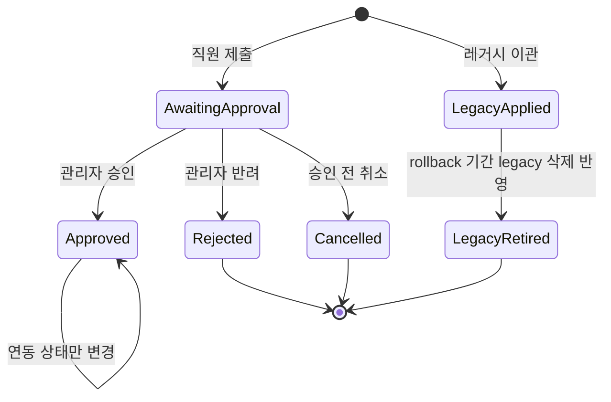
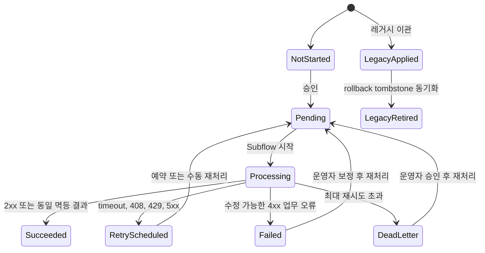

# The Helia Duty 희망휴무 ServiceNow 이관 런북

> 문서 상태: 구현 전 기준선 / v1.0
> 기준일: 2026-07-28
> 대상: The Helia Duty의 **희망휴무 신청·승인·근무표 연동 프로세스**
> 권장 방식: ServiceNow로 희망휴무 업무를 먼저 분리하는 단계적 이관(Strangler Pattern)

## 빠른 탐색

- [현재 구현과 작업 이력](#3-현재-서비스-작업내역과-구현-기준선)
- [구현 전 업무 결정](#4-업무-규칙-결정표)
- [ServiceNow 목표 설계](#5-servicenow-목표-설계)
- [단계별 구현 순서](#12-단계별-구현-런북)
- [데이터 이관](#13-데이터-이관-런북)
- [Cutover와 Rollback](#14-cutover와-rollback)
- [테스트 매트릭스](#15-테스트-매트릭스)
- [운영 절차](#16-운영-런북)
- [작업 패키지와 산출물](#17-작업-패키지와-산출물)
- [면접 설명 구조](#18-면접-설명-구조)

## 1. 목적과 완료 기준

이 프로젝트의 목표는 현재 관리자 중심의 희망휴무 즉시 등록 기능을 다음과 같은 ServiceNow 업무 프로세스로 전환하는 것이다.

1. 직원이 본인의 희망휴무를 신청한다.
2. 서버가 월 최대 2일, 중복, 날짜 정책을 검증한다.
3. 직원의 관리자에게 승인 또는 반려가 배정된다.
4. 승인된 요청만 기존 The Helia Duty 근무표 시스템에 REST로 전달한다.
5. 연동 실패는 요청 승인 상태와 분리해 기록하고 자동 또는 수동으로 재처리한다.
6. 신청, 승인, 상태 변경, 연동 시도를 감사 가능한 형태로 보존한다.
7. 월별·부서별 신청 현황과 승인·연동 상태를 대시보드에서 확인한다.

완료는 화면이 동작하는 것만 의미하지 않는다. 아래 항목이 모두 증명되어야 한다.

- 신청자, 관리자, 운영자 권한을 서로 바꿔 로그인해 ACL 테스트를 통과한다.
- 한 직원의 같은 달 1·2번째 신청은 허용되고 3번째 신청은 UI와 서버 양쪽에서 차단된다.
- 병렬 제출에서도 월 slot unique와 date claim unique가 각각 최대 2건·1건을 보장한다.
- 승인된 요청만 외부 REST 호출을 발생시킨다.
- 동일 요청을 여러 번 전송해도 외부 시스템에는 한 번만 반영된다.
- 타임아웃, HTTP 429, 5xx가 재시도되고 영구 오류는 운영자 조치 대상으로 분리된다.
- 신청부터 승인, 외부 전송, 재처리까지 기록만으로 전체 경로를 재구성할 수 있다.
- 기존 Supabase 데이터와 이관 데이터의 직원·날짜·건수가 일치한다.

## 2. 먼저 확정할 시스템 경계

이번 단계에서 전체 근무표·객실 관리 시스템을 ServiceNow로 옮기지 않는다.

| 영역 | 기준 시스템(System of Record) | 설명 |
| --- | --- | --- |
| 사용자, 부서, 관리자 | ServiceNow `sys_user`, `cmn_department` | 로그인과 조직 관계의 기준 |
| 희망휴무 신청·승인 | ServiceNow | 요청 상태, 승인, 감사의 기준 |
| 외부 연동 상태·시도 로그 | ServiceNow | 실패, 재시도, 오류 대응의 기준 |
| 직원 외부 식별자 매핑 | ServiceNow Employee Profile | 기존 Supabase 직원 UUID와 `sys_user`의 crosswalk 기준 |
| 직종·고용형태 | 기존 Supabase `staff` | 현재 자동배정이 소비하므로 1차 이관에서는 기준 유지 |
| 월 근무표·자동배정 | 기존 Next.js/Supabase | 현재 기능을 유지 |
| 승인된 희망휴무의 근무표용 복제본 | 기존 Supabase `wanted_offs` | ServiceNow 승인 결과를 소비하는 read model |

즉, ServiceNow 승인 상태와 Supabase 반영 상태를 같은 값으로 취급하지 않는다.

- `업무 상태 = Approved`
- `연동 상태 = Succeeded / Retry Scheduled / Failed / Dead Letter`

외부 시스템 장애가 발생해도 관리자의 승인 결정은 취소되지 않는다.

## 3. 현재 서비스 작업내역과 구현 기준선

### 3.1 현재 서비스 구성

The Helia Duty는 Next.js 15 App Router, React 19, TypeScript, TanStack Query, Supabase로 구성된 내부 운영 대시보드다. 직원, 월 근무표, 희망휴무, 자동배정, CSV, 입퇴실·객실, 주간 근무표 공유 기능이 함께 있다.

희망휴무와 직접 관련된 현재 흐름은 다음과 같다.

1. 관리자가 근무표에서 직원을 선택한다.
2. 직원 일정 관리 시트에서 날짜를 최대 2개 선택한다.
3. 적용 버튼을 누르면 추가분은 `POST /api/wanted-offs`, 삭제분은 `DELETE /api/wanted-offs`로 동시에 저장된다.
4. 별도의 제출, 승인, 반려 상태는 없다.
5. 저장된 날짜는 근무표에 희망휴무로 표시되고 자동배정 입력으로 사용된다.

### 3.2 저장소에서 확인한 관련 작업 이력

| 시점/커밋 | 확인된 작업 |
| --- | --- |
| 2026-02-11 `b335a76` | `wanted_offs` 테이블, 희망휴무 API, 신청 UI 최초 구현 |
| 2026-02-16 `7abadbd`, `d33eb15` | 자동 근무배정 구현 및 희망휴무 고정 OFF 반영 |
| 2026-02-20 `da2ded9` | 희망휴무 API·UI의 TypeScript 오류 객체·타입 처리 정리 |
| 2026-02-22 `296b18c` 이후 | 직원별 근무표 공유 기능 추가 및 개선 |
| 2026-04-17 `95012c6` | 화면 분리와 `docs/architecture.md` 추가 |
| 2026-04-23 `53cd3f2` → `679eaa5` → `1441b55` | Supabase 접근 보강, revert, service-role 방식 재적용 |
| 2026-05-04 `6c0406b` | README에 현재 서비스 범위 문서화 |

이 표는 저장소 커밋을 기준으로 한 구현 이력이다. 운영 배포일이나 실제 사용자 수를 의미하지 않는다.

### 3.3 현재 구현과 ServiceNow 신규 범위

| 항목 | 현재 구현 | ServiceNow 이관에서 할 일 |
| --- | --- | --- |
| 직원 | 이름, 직종, 고용형태, 표시 순서, 담당 가능 인원 | `sys_user` 연결, 부서, 관리자, 활성 상태, 외부 UUID 매핑 |
| 희망휴무 | 직원 UUID와 날짜 한 행 | 신청자, 상태, 사유, 승인자, 결정 시각, 연동 상태 추가 |
| 월 2일 제한 | UI 검사 + API의 `count → insert` | Client Script/집계는 안내, Active Claim unique slot이 권위 검증 |
| 중복 방지 | DB `UNIQUE(staff_id, wanted_date)` | 활성 date claim unique + 서버 BR |
| 권한 | 단일 관리자 세션에 가까움 | 신청자·관리자·운영자·앱 관리자 ACL |
| 승인 | 없음, 저장 즉시 적용 | Flow Designer `Ask for Approval` |
| 근무표 반영 | 같은 앱이 `wanted_offs`를 직접 조회 | 승인 후 전용 REST API로 멱등 동기화 |
| 재처리 | 없음 | 재시도 횟수, 다음 시각, Dead Letter, 수동 재처리 |
| 감사 | `created_at` 정도 | 테이블 Audit, 승인 기록, 완결 후 불변인 연동 시도 로그 |
| 보고 | 근무표 내 표시 | 월별 신청, 승인, 처리시간, 연동 성공률 Dashboard |

### 3.4 현행 코드에서 확인된 주의점

다음 문제는 ServiceNow에 그대로 복제하지 않는다.

1. **현재는 직원 셀프서비스가 아니다.** 관리자가 특정 직원을 골라 즉시 희망휴무를 넣는다.
2. **승인 상태가 없다.** `wanted_offs`는 `id`, `staff_id`, `wanted_date`, `created_at`만 가진다.
3. **월 2일 검사가 원자적이지 않다.** 서로 다른 날짜의 동시 요청은 모두 사전 count를 통과할 수 있다.
4. **교체 저장이 부분 실패할 수 있다.** 삭제와 추가가 `Promise.all`로 함께 실행된다.
5. **HTTP 오류가 성공으로 보일 수 있다.** UI가 각 `fetch` 결과의 `res.ok`를 확인하지 않는다.
6. **역할과 소유권 검증이 없다.** API 미들웨어는 `x-auth-session` 헤더의 존재만 확인한다.
7. **파트타임 정책이 불일치한다.** UI와 API는 파트타임 신청을 허용하지만 자동배정은 정규직 희망휴무만 고정 OFF로 처리한다.
8. **기존 근무와 충돌할 수 있다.** 이미 저장된 근무는 자동배정에서 고정되므로 나중에 등록된 희망휴무가 실제 근무 코드를 바꾸지 않을 수 있다.
9. **외부 연동과 재처리가 없다.**
10. **저장소 SQL은 전체 운영 DDL이 아니다.** `staff`, `schedules`, `admins`의 최초 생성문이 없으므로 실제 운영 DB 스키마를 별도로 추출해야 한다.
11. **직원 삭제가 희망휴무를 물리 삭제할 수 있다.** API가 관련 행을 먼저 삭제하고 DB FK도 `ON DELETE CASCADE`이므로, 이관 후에는 직원 soft-delete와 참조 보존이 필요하다.
12. **`wanted_offs.staff_id`가 저장소 DDL상 NOT NULL이 아니다.** 운영 데이터의 null 직원 행을 별도 격리해야 한다.

주요 코드 근거는 다음과 같다.

- 희망휴무 테이블: `supabase/schema.sql:16-35`
- 월 2일 API 검증: `app/api/wanted-offs/route.ts:47-76`
- UI 선택 제한과 동시 저장: `components/excel-view/wanted-off-dialog.tsx:72-145`
- 현재 세션과 헤더 검사: `lib/auth.ts:1-51`, `middleware.ts:3-27`
- 근무표 조회·병합: `components/excel-view.tsx:390-502`
- 자동배정의 희망휴무 반영: `lib/auto-scheduler.ts:86-143`
- 기존 일정 고정 처리: `lib/auto-scheduler.ts:111-143`
- 근무표 API의 직접 upsert: `app/api/schedules/route.ts:32-48`

## 4. 업무 규칙 결정표

구현 전에 업무 담당자가 아래 정책을 승인해야 한다. 미결 항목은 코드로 추측하지 않는다.

| ID | 결정 항목 | 권장 기본값 | 이유 |
| --- | --- | --- | --- |
| POL-01 | “월 2회”의 의미 | 직원별 달력월 최대 2일 | 현재 동작과 일치 |
| POL-02 | 한도에 포함할 상태 | 승인 대기 + 승인 + 이관된 적용 건 | 반려·취소 시 한도 반환, 기존 적용일 유지 |
| POL-03 | 파트타임 신청 | 모든 활성 직원 허용 | 제시된 목표 범위와 UI 문구에 부합. 단, 기존 자동배정 수정이 선행 조건 |
| POL-04 | 과거 날짜 | 금지 | 운영 오류 방지 |
| POL-05 | 신청 가능 기간 | 대상 월 전월 1일~말일 등 설정값 | 하드코딩하지 않고 System Property로 관리 |
| POL-06 | 승인자 | 제출 시점 `sys_user.manager` | 조직 변경 후에도 승인 근거 보존 |
| POL-07 | 관리자 없음·승인 timeout | 전용 Fallback Approvers 그룹 1회 이관 후 재만료 시 자동 취소 | 승인 Flow 무기한 정지 방지, 자동 승인은 금지 |
| POL-08 | 자기 승인 | 금지, 전용 Fallback Approvers 그룹으로 전달 | 직무 분리 |
| POL-09 | 승인 후 취소 | MVP에서는 운영자 처리, 2차 범위에서 취소 승인·외부 취소 API | 외부 보상 트랜잭션이 필요 |
| POL-10 | 기존 non-OFF 근무 row와 충돌 | 자동 덮어쓰기 금지, `SCHEDULE_CONFLICT`로 운영자 처리 | 저장소에는 확정 상태가 없으므로 실제 row를 기준으로 근무 손실 방지 |
| POL-11 | 보존 기간 | 요청·승인 감사 정책에 맞춰 확정 | 조직 보안·개인정보 정책 필요 |

**Go-live 차단 항목:** POL-03과 POL-10이 확정되지 않으면 통합 테스트를 완료할 수 없다.

## 5. ServiceNow 목표 설계

### 5.1 Scoped Application

- Application: `The Helia Duty - Wanted Off`
- Scope 예시: `x_<vendor>_helia_duty`
- 모든 테이블, Flow, Script Include, ACL, REST Message, Report는 이 scope 안에 생성한다.
- 비밀값을 스크립트나 일반 System Property에 넣지 않는다.
- 개발·테스트·운영 인스턴스를 분리하고 앱 저장소 또는 조직 표준 배포 수단으로 승격한다.

권장 요청 테이블은 **Task 확장 테이블**이다. Number, State, Approval, Activity, 담당자 같은 공통 기능과 승인 흐름을 활용하기 쉽고 Record Producer의 대상에도 맞는다. 단, 대상 인스턴스의 App Engine/custom table 라이선스와 Task 확장 권한은 시작 전에 확인한다.

Task 확장이 허용되지 않으면 독립 테이블에 Number, State, Approval Choice와 승인 이력용 Journal을 직접 만들고 Workspace/Form 또는 Catalog Item → Flow Create Record 패턴을 사용한다. Record Producer는 task 기반 레코드에만 사용한다.

기능별 적용 위치:

| ServiceNow 기능 | 이 프로젝트의 사용처 |
| --- | --- |
| Table / Reference Field | Employee Profile, Wanted Off Request, Approval Round, Payload Version, Active Claim, Integration Attempt와 `sys_user`·부서 참조 |
| Form / Record Producer | 직원 셀프서비스 신청, 운영자 상세·재처리 화면 |
| Client Script / UI Policy | 날짜·월 사용량 안내, 필수·read-only·조건부 표시 |
| Business Rule | 서버 제출 검증, snapshot, 상태 전이 보호 |
| Script Include | 월 한도·중복·접근·재처리 공통 로직 |
| GlideRecord / GlideAggregate | 중복 조회와 월별 건수 집계 |
| Flow Designer | 관리자 승인, 알림, 연동 dispatch, 예약 재처리 |
| ACL | 신청자·승인자·운영자·관리자 행/필드 권한 |
| REST Message / IntegrationHub | 승인 결과를 기존 근무표 시스템에 전달 |
| Report / Dashboard | 월별 신청, 승인 지연, 연동 성공·실패 현황 |
| Audit / History | 요청 필드 변경, 승인 결정, 외부 시도 증적 |

### 5.2 역할

아래 `<scope>`는 실제 애플리케이션 scope로 치환한다.

| Role | 책임 |
| --- | --- |
| `<scope>.requester` | 본인 신청 생성·조회 |
| `<scope>.approver` | 자신에게 배정된 승인 처리 |
| `<scope>.operator` | 전체 신청 조회, 매핑 오류 보정, 실패 재처리 |
| `<scope>.admin` | 앱 설정, 역할, 정책, 전체 관리 |

권장 역할 포함 관계:

- `approver` contains `requester`
- `operator` contains `requester`
- `admin` contains `approver`, `operator`

역할 포함이 곧 레코드 접근을 의미하지는 않는다. 실제 행과 필드 접근은 ACL로 다시 제한한다.

승인 대상으로 사용될 관리자는 사전에 approver group/role을 받아야 한다. Flow가 approval record를 배정해도 사용자가 앱 role이나 request read ACL을 통과하지 못하면 승인 화면을 열 수 없다. 운영 전 활성 Employee Profile의 manager 목록과 approver group 구성원을 대사한다.

관리자 부재·자기 승인용으로 `Wanted Off Fallback Approvers` 그룹을 별도로 만들고 모든 구성원에게 approver role을 부여한다. operator group을 승인 그룹으로 암묵적으로 재사용하지 않는다.

### 5.3 직원 프로필 테이블

Table: `<scope>_employee_profile`

Label: `Duty Employee Profile`

ServiceNow 계정을 새로 복제하지 않는다. 인증과 기본 조직 정보는 `sys_user`를 사용하고, The Helia Duty 전용 정보만 프로필에 둔다.

| 필드 | 타입 | 필수/제약 | 용도 |
| --- | --- | --- | --- |
| `user` | Reference → `sys_user` | 필수, unique | 로그인 사용자 연결 |
| `external_staff_id` | String(36+) | 필수, unique | 기존 Supabase `staff.id` UUID |
| `job_title` | Choice | 필수 | `nurse`, `assistant` |
| `employment_type` | Choice | 필수 | `full_time`, `part_time` |
| `staff_active` | True/False | 필수 | Supabase `staff.active` projection |
| `active` | True/False | 필수 | `user.active && staff_active && sync_status=in_sync`인 서버 계산 결과 |
| `legacy_display_order` | Integer | 선택 | 기존 표시 순서 보존 |
| `legacy_max_capacity` | Integer | 선택 | 기존 값 보존이 필요한 경우 |
| `last_verified_at` | Date/Time | 선택 | 사용자 매핑 검증 시각 |
| `source_version` | Long/Integer | 선택 | Supabase 직원 projection의 monotonic version |
| `last_synced_at` | Date/Time | 선택 | 마지막 정상 동기화 시각 |
| `sync_status` | Choice | 필수 | in_sync, stale, mapping_error |

이름, 이메일, 부서, 관리자는 원칙적으로 `user` 참조를 통해 읽는다. 다만 승인 당시의 부서와 관리자는 요청 레코드에 snapshot으로 저장한다.

Master-data ownership:

- 사용자 로그인 상태, 이름, 부서, 관리자: ServiceNow `sys_user`/조직 데이터
- 직종과 고용형태: 1차 이관에서는 기존 Supabase `staff`. 현재 자동배정이 이 값을 직접 소비하므로 Employee Profile은 동기화된 projection이다.
- Supabase 직원 UUID와 `sys_user`의 연결 관계: ServiceNow Employee Profile crosswalk
- Employee Profile의 `job_title`, `employment_type`, `staff_active`는 일반 폼에서 수정하지 않고 승인된 inbound sync로만 변경
- Profile `active`는 `sys_user.active`, `staff_active`, `sync_status`에서 서버가 계산한다. 두 기준 시스템이 불일치하거나 sync가 stale/mapping_error면 false로 두고 신청을 막는다.
- 운영자 보정 Action은 crosswalk를 고친 뒤 source를 다시 동기화한다. 직종·고용형태의 새 master 값을 ServiceNow에서 임의로 만들지 않는다.
- 향후 ServiceNow로 직종·고용형태의 기준을 옮기려면 ServiceNow → Supabase 역방향 동기화, scheduler contract test, cutover를 먼저 구현한다.

Joiner/Mover/Leaver:

- 입사: 기존 시스템 owner가 Supabase `staff`를 만들고, `sys_user`와 crosswalk를 검증한 뒤 Employee Profile projection과 requester role을 생성
- 부서·관리자 변경: `sys_user`를 갱신하며 기존 요청 snapshot은 바꾸지 않음
- 직종·고용형태 변경: Supabase `staff` 변경을 Employee Profile에 동기화하고 source version/변경 시각을 audit
- 퇴사: 각 기준 시스템의 비활성 상태를 동기화해 신규 신청을 막고 요청·claim·receipt는 삭제하지 않음
- 매일 active user인데 Profile/외부 UUID가 없거나 그 반대인 예외 보고서를 확인
- `last_synced_at`이 설정된 stale threshold를 넘거나 source version이 뒤처진 Profile도 같은 예외 queue로 보냄

Projection sync 런북:

1. 기존 `staff`에 없다면 DB trigger/sequence 기반 monotonic `sync_version`, `updated_at`, `active`를 먼저 추가한다. 서비스 인증이 필요한 `GET /api/integrations/servicenow/staff-projection?since=<watermark>`는 staff UUID, job title, employment type, active, source version, updated at만 반환한다.
2. ServiceNow Scheduled Flow/REST Message가 15분 delta와 매일 1회 full snapshot을 가져와 Import Set에 적재한다. watermark는 batch 전체 Transform과 대사가 성공한 뒤에만 전진한다.
3. Transform은 `external_staff_id`로 coalesce한다. 더 낮은 source version은 무시하고, 같은 version·같은 hash는 replay 성공, 같은 version·다른 값은 `PROFILE_VERSION_MISMATCH`로 격리한다.
4. 기존 crosswalk가 있는 행만 자동 update한다. 새 external UUID는 이름으로 `sys_user`를 자동 연결하지 않고 mapping queue로 보낸다.
5. 정상 행은 job/employment/staff_active/source version/last synced를 갱신하고 effective active를 재계산한다. source에서 사라진 행은 한 번에 삭제하지 않고 full snapshot 2회 확인 후 `staff_active=false`로 전환한다.
6. 429/5xx/timeout은 backoff 재시도하고 인증·schema·version 오류는 운영 알림한다. 마지막 성공 watermark, received/updated/rejected count를 Import Set run/Flow execution과 운영 dashboard에 남긴다.
7. 요청 제출은 `sync_status=in_sync`와 stale threshold를 강제한다. 승인 직전에도 다시 확인하되 이미 승인된 payload는 현재 projection으로 몰래 바꾸지 않는다.

조직에 기존 MDM/HR integration 표준이 있으면 위 endpoint 대신 그 Import Set/IntegrationHub pattern을 사용하되 version, replay, watermark, soft-deactivate, error queue 요구사항은 유지한다.

### 5.4 희망휴무 신청 테이블

Table: `<scope>_wanted_off_request`

Label: `Wanted Off Request`

Extends: `Task` 권장

| 필드 | 타입 | 설명 |
| --- | --- | --- |
| `number` | Task 상속 | 자동 번호 `WO########` |
| `requested_for` | Reference → `sys_user` | 휴무 대상 직원 |
| `employee_profile` | Reference → Employee Profile | 외부 직원 ID 연결 |
| `requested_date` | Date | 희망휴무 날짜 |
| `request_month` | Date | 대상 월의 1일로 정규화 |
| `reason` | String / Multi-line | 신청 사유 |
| `state` | Choice | 20 승인 대기, 30 승인, 40 반려, 50 취소, 60 레거시 적용, 70 레거시 종료 |
| `approval` | Task 상속 | Requested, Approved, Rejected 등 |
| `current_approval_round` | Reference → Approval Round | 현재 Ask correlation |
| `approval_round` | Integer | 현재 round cache, 최초 1·fallback 2 |
| `approval_operation` | Choice | none, opening, finalizing, cancelling, rolling |
| `approval_operation_token` | String | 승인 작업 lease/fencing token |
| `approval_operation_started_at` | Date/Time | stale operation 회수 기준 |
| `manager_at_submit` | Reference → `sys_user` | 제출 당시 관리자 snapshot |
| `department_at_submit` | Reference → `cmn_department` | 제출 당시 부서 snapshot |
| `submitted_at` | Date/Time | 제출 시각 |
| `submitted_by` | Reference → `sys_user` | 실제 제출 실행자 |
| `submission_mode` | Choice | self, operator_proxy, legacy_import |
| `proxy_reason` | String | 대리 신청 시 필수 |
| `decided_by` | Reference → `sys_user` | 최종 결정자 |
| `decided_at` | Date/Time | 승인·반려 시각 |
| `approval_duration_seconds` | Integer | 제출부터 결정까지 보고용 duration |
| `rejection_reason` | String / Multi-line | 반려 사유 |
| `cancelled_by` | Reference → `sys_user` | 실제 취소 실행자 |
| `cancelled_at` | Date/Time | 취소 시각 |
| `cancellation_reason` | String | 취소 사유 |
| `source` | Choice | `servicenow`, `legacy_import` |
| `legacy_id` | String | 원본 `wanted_offs.id` |
| `legacy_created_at` | Date/Time | 원본 생성 시각 |
| `legacy_retired_at` | Date/Time | rollback 기간의 legacy 삭제 tombstone 반영 시각 |
| `quota_slot_no` | Integer | 월 한도 원자 예약 slot 1 또는 2 |
| `quota_claimed_at` | Date/Time | slot 확보 시각 |
| `quota_released_at` | Date/Time | 반려·취소로 slot 반환한 시각 |
| `quota_release_reason` | String | 반환 사유 |
| `integration_status` | Choice | 아래 연동 상태 참조 |
| `integration_version` | Integer | 승인 payload 버전, 최초 1 |
| `current_payload_version` | Reference → Payload Version | 현재 전송할 immutable version |
| `approved_payload_snapshot` | JSON/String | 현재 version의 read-only cache |
| `approved_payload_hash` | String | 현재 version hash의 read-only cache |
| `idempotency_key` | String | 현재 version key의 read-only cache |
| `correlation_id` | String | 요청·응답 추적 키 |
| `external_record_id` | String | 외부 시스템 결과 ID |
| `attempt_count` | Integer | 현재 Payload Version의 완료 시도 수 cache |
| `next_retry_at` | Date/Time | 다음 자동 재처리 시각 |
| `pending_since` | Date/Time | 유실된 Pending 회수 기준 |
| `processing_token` | String | 중복 worker 방지용 실행 token |
| `processing_started_at` | Date/Time | stale Processing 판정 기준 |
| `last_attempt_at` | Date/Time | 마지막 시도 시각 |
| `last_http_status` | Integer | 마지막 HTTP status |
| `last_error_code` | String | 정규화한 오류 코드 |
| `last_error_message` | String | 마스킹·길이 제한한 오류 요약 |
| `integrated_at` | Date/Time | 외부 반영 완료 시각 |
| `dispatch_trigger_type` | Choice | initial, scheduled, manual, stale_recovery |
| `dispatch_origin_status` | Choice | enqueue 직전 연동 상태 |
| `dispatch_requested_by` | Reference → `sys_user` | 승인자·수동 실행자·전용 system account |
| `dispatch_reason` | String | 자동 원인 또는 필수 수동 재처리 사유 |
| `dispatch_nonce` | String | dispatch 요청마다 새 GUID |
| `dispatch_requested_at` | Date/Time | dispatch enqueue 시각 |
| `decision_token` | String | 승인·반려·취소 조건부 전이 승자 확인용 nonce |

권장 인덱스:

- `(requested_for, request_month, state)` — 월 한도와 보고
- `(requested_for, requested_date)` — 중복 검사
- `(integration_status, next_retry_at)` — 재시도 대상 조회
- `idempotency_key` — unique
- `legacy_id` — 이관 중복 방지를 위해 unique 또는 source와 복합 unique

`(requested_for, requested_date)`를 무조건 unique로 만들면 반려·취소 후 새 레코드 재신청이 막힌다. 이 런북은 **승인 대기·승인·레거시 적용 상태의 중복만 Business Rule로 금지**하고 반려·취소 후 재신청을 허용한다. 조직이 같은 날짜에 평생 한 레코드만 허용하려면 unique index를 사용하고 기존 레코드를 재제출하는 방식으로 바꾼다.

### 5.4.1 immutable payload version 테이블

Table: `<scope>_wanted_off_payload_version`

Label: `Wanted Off Payload Version`

Request의 현재 snapshot 필드를 덮어쓰는 것만으로는 v2 생성 후 v1 전송 증적을 복구할 수 없다. 아래 행을 version마다 한 번 생성하고 수정·삭제하지 않는다.

| 필드 | 타입 | 제약/용도 |
| --- | --- | --- |
| `request` | Reference → Wanted Off Request | 필수 |
| `version` | Integer | 필수 |
| `version_key` | String | unique: `request_sys_id\|version` |
| `canonical_payload_snapshot` | JSON/String | 실제 전송 bytes를 재현할 canonical payload |
| `canonical_payload_hash` | String | SHA-256 |
| `idempotency_key` | String | unique |
| `created_at`, `created_by` | Date/Time, Reference | 생성 증적 |
| `creation_reason` | String | initial approval 또는 보정 티켓/사유 |
| `supersedes_version` | Reference → Payload Version | v2 이상에서 이전 version |

Attempt는 이 레코드를 참조하고 version/hash/key를 복사한다. Request의 snapshot/hash/key는 현재 version 조회용 cache일 뿐 감사 기준은 이 테이블이다. Payload Version은 지정 Action만 create, operator/admin read, 전 역할 update/delete 금지이며 보존 기간 동안 Attempt와 receipt 대사 기준으로 유지한다.

### 5.4.2 승인 라운드 테이블

Table: `<scope>_wanted_off_approval_round`

Label: `Wanted Off Approval Round`

`Ask for Approval`은 결정까지 Flow를 대기시키므로 다음 step에서 “방금 만든 approval rows”를 저장하는 설계는 사용하지 않는다. Ask를 호출하기 **전에** 라운드 행과 Request pointer를 만들고 approval row 생성 시점에 연결한다.

| 필드 | 타입 | 제약/용도 |
| --- | --- | --- |
| `request` | Reference → Wanted Off Request | 필수 |
| `round_no` | Integer | 1 또는 2 |
| `round_key` | String | unique: `request_sys_id\|round_no` |
| `active` | True/False | 현재 round 여부 |
| `active_key` | String | active일 때 request sys_id, unique |
| `status` | Choice | creating, starting, requested, approved, rejected, timed_out, cancelled, error |
| `approver_user` | Reference → `sys_user` | 단일 승인자일 때 |
| `approver_group` | Reference → `sys_user_group` | fallback group일 때 |
| `decision_rule` | Choice | user_approves, anyone_approves |
| `creation_token` | String | Ask 생성 lease/fencing |
| `creation_started_at` | Date/Time | stale 생성 회수 |
| `opened_at`, `due_at`, `closed_at` | Date/Time | 라운드 생명주기 |
| `decision_approval_records` | Glide List → `sysapproval_approver` | round rule을 충족한 실제 결정 증적 |
| `flow_context` | String | 해당 Round의 Ask 실행 context; timeout drain과 복구 correlation |
| `supersedes_round` | Reference → Approval Round | fallback 연결 |

이 child Request를 참조하는 `sysapproval_approver`에 `wanted_off_approval_round` Reference dictionary extension을 만들고 Before Insert BR이 Request의 current round를 복사한다. cross-scope 정책상 extension이 금지되면 플랫폼 팀 global facade가 같은 연결을 수행한다.

Open/Fallback Action은 Request operation CAS를 얻은 뒤 active Round의 `active_key` unique를 먼저 확보하고 Request current pointer를 CAS한다. terminal 전이는 status, `active=false`, `active_key=NULL`, `closed_at`, 결정 증적을 한 guarded update로 기록하고 그 이후 update/delete를 차단한다. unique index가 여러 NULL을 허용하는지는 대상 release에서 실제 insert로 검증하고, 허용하지 않는다면 scoped DB unique 대신 active-key registry 테이블의 request unique 행을 acquire/release하는 같은 효과의 패턴을 사용한다. 두 레코드 사이가 끊기면 Reconciliation이 unique round를 adoption하거나 orphan round를 Error로 닫는다. Ask 직전과 approval-row Before Insert에서 Request가 Awaiting, `approval_operation=none`, pointer가 그 active Round인지 다시 검사하므로 Cancelled Request나 취소·roll 중인 Request에 늦은 approval이 붙지 않는다.

group의 `anyone_approves`는 한 라운드 안에 여러 active user approval rows가 생기는 것이 정상이다. 한 행이 Approved가 되면 나머지는 NLR로 닫혀야 하고, Rejected 결과는 설정한 Ask rule이 요구하는 rejection rows를 모두 충족해야 한다. finalizer는 개별 행 수가 아니라 Round `decision_rule`의 단일 업무 결과와 나머지 행의 terminal 정리를 확인한다. 오류 조건은 “여러 approval rows”가 아니라 같은 Request에 active Approval Round가 둘 이상이거나 서로 다른 round의 active rows가 공존하는 경우다.

Approval Round는 생성 후 audit하고 terminal이 되면 update/delete를 금지한다. 이전 round를 덮어쓰지 않으므로 manager round와 fallback round의 실제 approval rows를 장기 감사에서 재구성할 수 있다.

### 5.5 월 한도·날짜 Claim 테이블

Table: `<scope>_wanted_off_claim`

Label: `Wanted Off Active Claim`

단순 `count → insert`는 동시에 들어온 3건을 막지 못하므로 이 테이블의 DB unique 제약을 최종 권위로 사용한다.

v1의 월 한도는 요구사항대로 **2로 고정**한다. System Property가 2가 아니면 health check와 제출 로직이 `CONFIG_ERROR`로 fail closed한다. 한도를 3 이상으로 바꾸려면 slot 생성 범위, unique 예약 알고리즘, rollback reservation 월 집계, UI 문구와 병렬 테스트를 함께 바꾸는 새 release로 배포한다.

| 필드 | 타입 | 제약 |
| --- | --- | --- |
| `request` | Reference → Wanted Off Request | 필수, unique |
| `requested_for` | Reference → `sys_user` | 필수 |
| `request_month` | Date | 필수, 월 1일 |
| `requested_date` | Date | 필수 |
| `slot_no` | Integer | 1 또는 2 |
| `slot_key` | String | unique: `user_sys_id\|YYYY-MM\|slot_no` |
| `date_key` | String | unique: `user_sys_id\|YYYY-MM-DD` |

동기 Before BR의 서버 제출 로직은 slot 1, 실패하면 slot 2를 예약하고 Request insert 실패 시 함께 rollback되는 것을 대상 release에서 검증한다. 두 slot의 unique 충돌은 `MONTHLY_LIMIT`, date key 충돌은 `DUPLICATE_DATE`다. transaction 보장이 검증되지 않으면 go-live하지 않으며, 방어적으로 Request 없는 orphan claim과 claim 없는 Request reconciliation도 둔다.

반려·취소 시 guarded Action이 Request CAS에 성공한 뒤 active claim을 삭제해 slot을 재사용한다. 삭제가 끊기면 claim을 유지한 안전측 상태에서 reconciliation하며, 반환 완료 시각·사유를 기록한다. Approved와 Legacy Applied는 claim을 유지하고 Legacy Retired는 재컷오버 Action이 claim을 반환한다. 일반 사용자와 admin도 직접 claim을 삭제하지 못한다.

### 5.6 연동 시도 로그 테이블

Table: `<scope>_integration_attempt`

Label: `Wanted Off Integration Attempt`

| 필드 | 타입 | 설명 |
| --- | --- | --- |
| `request` | Reference → Wanted Off Request | 원 요청 |
| `attempt_no` | Integer | 1부터 증가 |
| `integration_version` | Integer | 승인 payload 버전 |
| `payload_version` | Reference → Payload Version | immutable 전송 증적 |
| `payload_hash` | String | Attempt 시점 hash |
| `dispatch_key` | String | unique: request + version + attempt |
| `started_at`, `ended_at` | Date/Time | 시도 구간 |
| `trigger_type` | Choice | initial, scheduled, manual, stale_recovery |
| `attempt_class` | Choice | auto, manual; version별 budget 집계 기준 |
| `initiated_by` | Reference → `sys_user` | 수동 실행자 또는 System |
| `retry_reason` | String | 수동 재처리 필수 사유 |
| `endpoint_alias` | String | 실제 비밀 URL 대신 논리 이름 |
| `http_method` | Choice | POST 등 |
| `correlation_id` | String | 양 시스템 공통 추적 ID |
| `idempotency_key` | String | 중복 방지 키 |
| `http_status` | Integer | 응답 코드 |
| `result` | Choice | success, retryable_failure, permanent_failure |
| `execution_token` | String | 해당 Attempt의 현재 lease/fencing token |
| `duration_ms` | Integer | 처리 시간 |
| `error_code` | String | 정규화 오류 코드 |
| `error_message` | String | 마스킹·길이 제한한 메시지 |
| `response_summary` | String | 민감정보를 제거한 응답 요약 |
| `flow_context` | String | Flow 실행 추적값 |
| `retry_scheduled_at` | Date/Time | 다음 시도 시각 |
| `recovery_type` | Choice | none, adopted_orphan, fenced_timeout |
| `recovery_token` | String | timeout recovery 재개용 fencing token |
| `recovery_phase` | Choice | none, attempt_fenced, request_fenced |
| `recovered_by` | Reference → `sys_user` | Recovery 실행 계정 |
| `recovered_at` | Date/Time | 회수·fencing 시각 |

로그에는 Authorization 헤더, OAuth token, 전체 개인정보 payload를 저장하지 않는다. 시스템은 호출 시작 시 생성하고 결과 수신 시 한 번 완결할 수 있으며, 완결 후에는 불변으로 둔다. 운영자는 read-only로 본다.

`ended_at`과 `result`가 모두 비어 있는 행만 미완결 Attempt다. `execution_token`은 최초 claim 또는 Recovery fencing 때만 바꿀 수 있고, 완결 후에는 시스템 action도 수정하지 않는다.

권장 unique index:

- `(request, integration_version, attempt_no)`
- `dispatch_key`

Integration Attempt insert 자체를 dispatch claim으로 사용한다. 같은 request/version/attempt를 두 worker가 시작하면 unique 제약에서 한쪽만 insert하고, 진 쪽은 기존 미완결 Attempt를 재조회해 live lease면 종료하고 orphan이면 adopt/timeout 절차로 넘긴다.

### 5.7 상태 모델

업무 상태와 연동 상태를 분리한다.



권장 내부 상태값:

| 구분 | Label | Value |
| --- | --- | --- |
| 업무 | Awaiting Approval | `20` |
| 업무 | Approved | `30` |
| 업무 | Rejected | `40` |
| 업무 | Cancelled | `50` |
| 업무 | Legacy Applied | `60` |
| 업무 | Legacy Retired | `70` |
| 연동 | Not Started | `not_started` |
| 연동 | Pending | `pending` |
| 연동 | Processing | `processing` |
| 연동 | Succeeded | `succeeded` |
| 연동 | Retry Scheduled | `retry_scheduled` |
| 연동 | Failed | `failed` |
| 연동 | Dead Letter | `dead_letter` |
| 연동 | Legacy Applied | `legacy_applied` |
| 연동 | Legacy Retired | `legacy_retired` |

Task에서 상속된 다른 State choice가 폼에 섞이지 않도록 이 child table에 적용되는 choice를 위 값으로 제한한다. 전역 Task choice는 수정하거나 삭제하지 않고 child table override만 만든다. 스크립트는 label이 아니라 internal value를 사용한다.

`Legacy Applied`는 과거 시스템에서 즉시 적용됐지만 관리자 승인 증적은 없는 행이다. 이를 `Approved`로 변환해 존재하지 않는 승인 이력을 만들지 않는다. 월 한도와 중복 검사에서는 Awaiting Approval, Approved, Legacy Applied를 모두 유효한 신청으로 센다.

`Legacy Retired`는 rollback 기간에 기존 시스템에서 삭제된 legacy 행을 재컷오버 때 tombstone으로 동기화한 상태다. 이를 사용자 `Cancelled`로 위장하지 않으며 한도와 중복 검사에서 제외하고 claim을 반환한다.

Task lifecycle:

| 조건 | `active` | `closed_at` |
| --- | --- | --- |
| Awaiting Approval | true | 비움 |
| Approved + Pending/Processing/Retry/Failed/Dead Letter | true | 비움 |
| Approved + Succeeded | false | `integrated_at` |
| Rejected/Cancelled | false | `decided_at` 또는 취소 시각 |
| Legacy Applied | false | import 시각, 원본 완료 시각이 아님을 표시 |
| Legacy Retired | false | `legacy_retired_at` |

Task에서 상속되는 `short_description`은 `YYYY-MM-DD 희망휴무 - 직원명`으로 만들고 `opened_by`는 실제 제출자로 보존한다. Activity는 사용자 댓글에만 사용하고 `approval_history`는 Ask action 결과와 일치시킨다. child table에 영향을 주는 기존 Task Business Rule, SLA, Notification, Assignment Rule을 목록화하고 이 앱에 불필요한 것은 조건에서 제외한다. Classic Approval Engine은 이 child table에서 끄고 `Ask for Approval`만 승인 상태를 소유하게 한다.

연동 상태:



레거시 이관 레코드는 `state=Legacy Applied`, `approval=Not Requested`, `integration_status=Legacy Applied`, `source=legacy_import`로 저장하고 승인·REST Flow를 실행하지 않는다.

## 6. ACL 설계

UI Policy나 숨김 필드는 보안 통제가 아니다. 모든 권한은 table/field ACL에서 최종 집행한다.

### 6.1 요청 테이블 ACL

| Operation | Requester | Approver | Operator | Admin |
| --- | --- | --- | --- | --- |
| create | 본인 요청만 | 본인 요청만 | 대리 신청 화면을 통해 가능 | 가능 |
| read | `requested_for = current user` | 자신에게 active 또는 completed `sysapproval_approver` 행이 있는 요청 | 전체 | 전체 |
| write | 직접 필드 수정 금지, 허용된 취소 UI Action만 | 요청 직접 수정 금지, Approval record로 결정 | 허용된 운영 Action만 | 설정·break-glass Action만 |
| delete | 금지 | 금지 | 금지 | 금지 |

일반 Record Producer 생성은 `requested_for=submitted_by=gs.getUserID()`, `submission_mode=self`로 서버가 강제한다. 클라이언트가 proxy flag나 타 사용자 sys_id를 보내도 무시한다. 대리 신청은 operator-only `WO - Submit Proxy Request` server Action만 대상 사용자와 필수 사유를 받고 `submitted_by`, `submission_mode=operator_proxy`, `proxy_reason`을 기록한다. 일반 table insert로 이 분기를 선택할 수 없다.

`manager_at_submit`은 감사 snapshot일 뿐 접근권한 근거로 사용하지 않는다. 관리자가 바뀌거나 approval이 재배정되면 실제 approval assignee만 요청을 읽고, active approval assignee만 결정할 수 있다. 잘못 생성된 행도 삭제하지 않고 Cancelled/정정 레코드로 보존한다.

Fallback group approval을 쓰는 release에서는 Ask action이 만든 실제 user approval row를 기준으로 하거나, group approval 레코드와 현재 사용자의 group membership을 함께 확인한다. 단순히 group role만 있다고 모든 요청을 읽게 하지 않는다.

### 6.2 Employee Profile·Claim ACL

Employee Profile:

- requester: 본인 profile read
- approver: 본인 approval 이력이 있는 대상 직원 profile read
- operator/admin: 전체 read
- create/write: 지정 inbound sync 또는 master-data 보정 Action
- delete: 전 역할 금지, `active=false`로 퇴사 처리

Active Claim:

- create/delete: 제출·결정·취소·legacy retire용 시스템 action만
- read: operator/admin
- write: 금지
- 일반 form/list 메뉴에 노출하지 않음

Payload Version:

- create: 승인·새 version 준비용 지정 Action만
- read: operator/admin
- update/delete: 전 역할 금지
- Request/Attempt reference가 있는 동안 보존

Approval Round:

- create/update: 지정 Approval Action과 approval-row correlation BR만
- read: 관련 requester/approver는 안전한 요약, operator/admin은 전체
- terminal update/delete: 전 역할 금지
- 같은 Request의 active round는 1개만 허용

### 6.3 필드·Task 상속 ACL

| 필드군 | 쓰기 허용 |
| --- | --- |
| `requested_date`, `reason` | 생성 시 신청자, 대리 신청 시 운영자 |
| `submitted_by`, `submission_mode`, `proxy_reason`, `cancelled_*`, `cancellation_reason` | 지정 Submit/Cancel Action |
| `state`, `approval`, `approval_round`, `current_approval_round`, `approval_operation_*`, `manager_at_submit`, `decided_*`, `decision_token` | 지정 guarded Flow Action |
| `rejection_reason` | 실제 Approval 결과를 지정 Flow Action이 복사 |
| `integration_*`, `attempt_*`, `last_error_*`, `dispatch_*`, `processing_*` | 지정 Integration Action |
| `legacy_*`, `source` | Import/관리자 |

`requested_date`와 `reason`은 requester에게 field **create** ACL을 주되 일반 **write** ACL은 주지 않는다. 제출 후 수정 대신 취소·재신청 정책을 사용한다.

Task 상속 필드 `active`, `closed_at`, `short_description`, `comments`, `work_notes`, `assignment_group`에도 명시적인 read/write ACL을 둔다. 특히 Activity journal이 신청자에게 운영자 work note나 외부 오류를 노출하지 않는지 impersonation으로 검증한다.

신청자는 상세 오류 메시지와 외부 식별자를 볼 필요가 없다. 신청 화면에는 “근무표 반영 대기/완료/운영자 확인 중” 정도의 안전한 상태만 표시한다.

### 6.4 연동 로그 ACL

- create: 지정 Integration Action만
- read: operator, admin
- write: 동일 Integration Action이 미완결 attempt를 완결할 때만 허용
- delete: 전 역할 금지
- delete ACL의 admin override는 끔

Before BR로 `ended_at`이 이미 있는 attempt의 추가 수정을 막는다.

`Flow/System`은 역할 이름이 아니다. 각 Flow와 Action의 Run As를 명시하고, 사람 사용자는 위 update 경로를 호출할 수 없도록 action/execute ACL과 조건을 함께 적용한다.

### 6.5 공통 접근 Script Include

`HeliaDutyAccess`를 서버 전용 Script Include로 만들고 요청 read, retry UI Action 조건을 한곳에 둔다.

핵심 판정:

- 본인 요청인가?
- 현재 사용자에게 관련 approval record가 있는가? 결정 작업이면 active인가?
- operator/admin 역할이 있는가?
- 재처리 가능한 연동 상태인가?

Client callable로 만들지 않는다.

## 7. 입력 화면, Client Script, UI Policy

### 7.1 직원용 Record Producer

Label: `희망휴무 신청`

표시 변수:

- 희망휴무 날짜
- 신청 사유
- 현재 대상 월 사용량: `0/2`, `1/2`, `2/2`
- 월 한도와 신청 가능 기간 안내

숨김/서버 설정:

- 신청자 = 현재 로그인 사용자
- Employee Profile
- 부서와 관리자 snapshot
- source = `servicenow`

신청자가 다른 직원을 선택할 수 있는 reference field는 제공하지 않는다.

### 7.2 Catalog Client Script

역할은 빠른 피드백에 한정한다.

- 과거일 선택 시 즉시 안내
- GlideAjax로 대상 월 현재 사용량 조회
- 이미 2일이면 제출 버튼 비활성화와 메시지 표시
- 동일 날짜가 있으면 안내

GlideAjax용 `HeliaWantedOffAjax`는 최소 기능만 공개하는 별도 client-callable facade로 만들고, 서버 전용 `HeliaWantedOffPolicy`를 호출한다. 클라이언트가 보낸 사용자 sys_id를 신뢰하지 않고 항상 `gs.getUserID()` 기준으로 계산하며 execute ACL을 적용한다.

```javascript
var HeliaWantedOffAjax = Class.create();
HeliaWantedOffAjax.prototype = Object.extendsObject(global.AbstractAjaxProcessor, {
    getUsage: function () {
        var requestMonth = String(this.getParameter('sysparm_request_month') || '');
        return JSON.stringify(
            new HeliaWantedOffPolicy().getUsageForUser(
                gs.getUserID(),
                requestMonth
            )
        );
    },
    type: 'HeliaWantedOffAjax'
});
```

반환값은 필요한 `count`, `limit`, 안전한 오류 코드만 직렬화한다. 다른 직원의 ID나 요청 목록을 반환하지 않는다.

클라이언트 검증을 우회해도 저장되지 않도록 서버 Business Rule이 같은 규칙을 다시 검증한다.

### 7.3 UI Policy

Catalog UI Policy:

- Record Producer의 `requested_date` 변수 필수
- 날짜 정책 안내와 조건부 사유 표시

Wanted Off Request Form UI Policy:

- 승인 후 `requested_for`, `requested_date`, `reason` read-only
- 연동 필드는 신청자 view에서 숨김
- operator view에서 실패 코드, 다음 재시도 시각 표시

반려 사유 필수는 Request Form UI Policy가 아니라 Approval 결정 시점의 서버 검증으로 보장한다.

### 7.4 취소·대리 신청 Action

Requester UI Action: `신청 취소`

- 본인 Request이며 Awaiting Approval일 때만 표시
- 현재 사용자를 actor로 서버에 전달하고 확인 dialog에서 취소 사유를 받음
- `WO - Cancel Awaiting Request`가 authorization과 최신 상태를 다시 확인
- CAS 승리 시 `cancelled_by`, `cancelled_at`, `cancellation_reason`을 상태와 함께 기록
- System Run As Flow의 `sys_updated_by`를 실제 actor로 오인하지 않음
- 성공·경합 패배·이미 결정됨을 구분해 신청자에게 알리고 관리자에게 cancellation 결과 알림

Operator 대리 신청은 일반 직원 Producer에 대상 사용자 field를 추가하지 않고 별도 `대리 신청` UI Action/Workspace 화면에서 `WO - Submit Proxy Request`를 호출한다. 대상 직원, 날짜, 원 사유, 대리 사유를 필수로 하고 operator role을 서버에서 다시 확인한다.

## 8. Script Include와 Business Rule

### 8.1 `HeliaWantedOffPolicy` 책임

서버 전용 Script Include로 다음 로직을 모은다.

- 활성 Employee Profile과 연결된 활성 `sys_user` 확인
- `sync_status=in_sync`이고 `last_synced_at`이 stale threshold 이내인지 확인
- 신청자와 대상 직원 일치 확인
- 날짜 형식과 과거일 확인
- `request_month` 월 1일 계산
- 활성 상태의 같은 날짜 중복 조회: GlideRecord
- 월 사용량 안내 집계: GlideAggregate
- 월 slot·직원 날짜 unique claim 예약·반환
- 관리자와 fallback 승인자 결정
- 허용된 상태 전이 확인
- 재처리 가능 여부 확인

상태 값, 한도, 신청 기간을 여러 스크립트에 숫자로 반복하지 않는다. Script Include 상수와 scoped System Property를 사용한다.

개념 코드는 다음과 같다. 실제 table/field 이름과 날짜 API는 대상 인스턴스에서 검증한다.

```javascript
var HeliaWantedOffPolicy = Class.create();
HeliaWantedOffPolicy.prototype = {
    initialize: function () {
        this.TABLE = '<scope>_wanted_off_request';
        this.STATE_AWAITING = '20';
        this.STATE_APPROVED = '30';
        this.STATE_LEGACY = '60';
        this.COUNTED_STATES =
            this.STATE_AWAITING + ',' + this.STATE_APPROVED + ',' + this.STATE_LEGACY;
        this.MONTHLY_LIMIT = parseInt(
            gs.getProperty('<scope>.wanted_off.monthly_limit', '2'),
            10
        );
        this.CONFIG_VALID = this.MONTHLY_LIMIT === 2;
    },

    validateSubmission: function (requestedFor, requestedDate, excludeSysId, context) {
        var result = { ok: false, code: '', message: '' };
        context = context || { mode: 'self' };

        if (!this.CONFIG_VALID) {
            result.code = 'CONFIG_ERROR';
            result.message = '신청 한도 설정을 확인해 주세요.';
            return result;
        }

        if (!requestedFor || !requestedDate) {
            result.code = 'REQUIRED';
            result.message = '직원과 희망휴무 날짜가 필요합니다.';
            return result;
        }

        var normalizedDate = this.normalizeIsoDate(requestedDate);
        if (!normalizedDate) {
            result.code = 'INVALID_DATE';
            result.message = '희망휴무 날짜 형식이 올바르지 않습니다.';
            return result;
        }
        requestedDate = normalizedDate;

        // 아래 helper는 date-only 값을 Asia/Seoul 업무일로 계산한다.
        // 브라우저 timezone이나 서버 기본 timezone에 암묵적으로 의존하지 않는다.
        var today = this.getBusinessToday('Asia/Seoul');
        if (requestedDate < today) {
            result.code = 'PAST_DATE';
            result.message = '과거 날짜는 신청할 수 없습니다.';
            return result;
        }

        var window = this.getSubmissionWindow(requestedDate, 'Asia/Seoul');
        var proxyWindowOverride =
            context.mode === 'operator_proxy' &&
            context.allowWindowOverride === true &&
            !!context.overrideReason;
        if ((today < window.opensOn || today > window.closesOn) && !proxyWindowOverride) {
            result.code = 'OUTSIDE_SUBMISSION_WINDOW';
            result.message = '현재 신청 가능한 기간이 아닙니다.';
            return result;
        }

        var duplicate = new GlideRecord(this.TABLE);
        duplicate.addQuery('requested_for', requestedFor);
        duplicate.addQuery('requested_date', requestedDate);
        duplicate.addQuery('state', 'IN', this.COUNTED_STATES);
        if (excludeSysId) duplicate.addQuery('sys_id', '!=', excludeSysId);
        duplicate.setLimit(1);
        duplicate.query();
        if (duplicate.next()) {
            result.code = 'DUPLICATE_DATE';
            result.message = '같은 날짜의 유효한 신청이 이미 있습니다.';
            return result;
        }

        var requestMonth = this.getRequestMonth(requestedDate);

        var usage = new GlideAggregate(this.TABLE);
        usage.addAggregate('COUNT');
        usage.addQuery('requested_for', requestedFor);
        usage.addQuery('request_month', requestMonth);
        usage.addQuery('state', 'IN', this.COUNTED_STATES);
        if (excludeSysId) usage.addQuery('sys_id', '!=', excludeSysId);
        usage.query();

        var count = 0;
        if (usage.next()) count = parseInt(usage.getAggregate('COUNT'), 10) || 0;
        if (count >= this.MONTHLY_LIMIT) {
            result.code = 'MONTHLY_LIMIT';
            result.message = '월 최대 ' + this.MONTHLY_LIMIT + '일까지 신청할 수 있습니다.';
            return result;
        }

        result.ok = true;
        return result;
    },

    normalizeIsoDate: function (requestedDate) {
        var raw = String(requestedDate || '');
        if (!/^\d{4}-\d{2}-\d{2}$/.test(raw)) return '';

        var normalized = '';
        try {
            var date = new GlideDate();
            date.setValue(raw);
            normalized = date.getValue();
        } catch (e) {
            return '';
        }
        if (!normalized || normalized !== raw) return '';

        return normalized;
    },

    getRequestMonth: function (requestedDate) {
        var normalized = this.normalizeIsoDate(requestedDate);
        if (!normalized) return '';
        // GlideDate가 반환한 server-side ISO Date에서 월 첫날을 만든다.
        return normalized.substring(0, 7) + '-01';
    },

    // 실제 구현에서는 설정된 Asia/Seoul timezone과 신청 window System Property를
    // GlideDate/GlideDateTime으로 계산하고, invalid 설정이면 fail closed한다.
    getBusinessToday: function (timeZone) {
        return '<validated YYYY-MM-DD>';
    },

    getSubmissionWindow: function (requestedDate, timeZone) {
        return { opensOn: '<YYYY-MM-DD>', closesOn: '<YYYY-MM-DD>' };
    },

    type: 'HeliaWantedOffPolicy'
};
```

날짜는 `String 변환 → 정확한 YYYY-MM-DD 형식 → GlideDate 정규화값과 원문 일치`를 끝낸 후에만 과거일, window, 중복, 월 집계를 수행한다. 브라우저 Date 객체를 사용하지 않는다. 대상 release에서 invalid date 처리, KST 사용자, 월말, 윤년을 ATF로 검증한다. 위 count는 사용자 안내와 오류 메시지를 위한 보조 검사이고, 실제 월 2일·날짜 중복 보장은 `reserveClaim()`의 unique slot/date key가 담당한다.

기본 window는 대상 월의 직전 달 1일 00:00부터 말일 23:59:59까지이며 모두 `Asia/Seoul` date-only 기준으로 계산한다. POL-05가 다른 값을 채택하면 open/close rule을 System Property로 바꾸되 helper 한 곳에서만 해석한다. 과거일은 operator도 우회할 수 없고, 기간 예외는 operator proxy Action + 전용 role + 필수 사유 + audit가 모두 있을 때만 허용한다. 잘못된 timezone/property는 fail closed하고 운영 알림을 만든다.

위 `context`는 server Action이 만든 내부 객체이며 Catalog 변수, request body, 레코드 field에서 그대로 역직렬화하지 않는다.

### 8.2 Insert 초기화·Claim Business Rule

Name: `WO - Initialize and Claim Submission`

조건:

- insert
- `source=servicenow`

처리 순서:

1. 일반 insert는 `requested_for=submitted_by=gs.getUserID()`, `submission_mode=self`로 강제한다. operator 대리 신청은 execute ACL을 통과한 `WO - Submit Proxy Request`가 별도 server-only Script Include method로 생성하며, 레코드 field나 request parameter로 proxy 분기를 켤 수 없게 한다.
2. 활성 Employee Profile과 연결된 활성 `sys_user`를 조회한다.
3. `request_month`를 대상 월 1일로 설정한다.
4. `HeliaWantedOffPolicy.validateSubmission()`으로 사용자용 사전 오류를 확인한다.
5. `reserveClaim()`으로 같은 트랜잭션에서 date key와 월 slot 1 또는 2를 unique 예약한다.
6. 실패하면 claim 오류를 `DUPLICATE_DATE` 또는 `MONTHLY_LIMIT`로 정규화하고 insert를 중단한다.
7. 부서와 관리자를 snapshot으로 복사하고 관리자 부재·자기 승인 fallback을 결정한다.
8. `state=Awaiting Approval`, `approval=Not Requested`, `active=true`, `submitted_at=now`를 설정한다.
9. `short_description`과 `quota_slot_no`, `quota_claimed_at`을 설정한다.

`approval`은 이 BR이 Requested로 바꾸지 않는다. `Ask for Approval` action만 Requested/Approved/Rejected 값을 관리한다.

Legacy Import는 같은 BR의 느슨한 분기가 아니라 별도 Transform/`WO - Initialize Legacy Import` 로직으로 처리한다. `state=Legacy Applied`, `approval=Not Requested`, `active=false`를 설정하고 claim을 예약하되 승인·REST Flow는 실행하지 않는다. 월 2일 초과, null 직원, 미매핑 직원은 import 예외 테이블로 격리한다.

### 8.3 Update 검증·상태 전이 Business Rule

Name: `WO - Guard State Transition`

허용 전이:

- Awaiting Approval → Approved
- Awaiting Approval → Rejected
- Awaiting Approval → Cancelled
- Legacy Applied → Legacy Retired는 재컷오버 Transform 전용

Approved 전이는 `approval=approved`, current Approval Round rule을 만족하는 완료된 Approved approval 증적, 정확히 1개의 Active Claim이 모두 있을 때만 허용한다. Rejected도 `approval=rejected`와 Round rule을 만족하는 Rejected 증적을 확인한다. Cancelled는 Approved와 Rejected를 포함한 **어떤 최종 결정도 없고** current round의 모든 대기 approval이 `Cancelled/No Longer Required`로 종료된 경우만 허용하며 final CAS에서 Request `approval=Not Requested`로 정규화한다. terminal Request의 approval/state 재변경은 같은 decision token을 가진 lifecycle reconciliation 외에는 차단하므로 늦게 종료된 old Ask가 Cancelled Request의 approval을 다시 덮지 못한다. 승인된 날짜나 대상 직원의 직접 수정도 차단한다.

일반 Flow의 Update Record step을 권위 전이에 사용하지 않는다. 다음 scoped server Action을 만들고 내부 Script Include가 조건부 update를 수행한다.

- `WO - Finalize Approval Decision`: Request sys_id, Approval Round sys_id, 기대 업무 결과, 기대 `sys_mod_count`, decision nonce를 입력받는다.
- `WO - Cancel Awaiting Request`: Request sys_id, 기대 `sys_mod_count`, 취소 사유, decision nonce를 입력받는다.
- `WO - Begin Approval Roll`: due date가 지난 current Round rows를 No Longer Required로 닫고 old Ask context drain을 시작한다.
- `WO - Open Fallback Round`: old Ask context가 terminal인 것을 검증한 뒤 Task approval을 정규화하고 fallback Round를 연다.
- `WO - Retire Legacy Request`: tombstone과 legacy source를 검증하는 재컷오버 Transform 전용이다.

Finalize, Cancel, Begin Roll, Open Fallback은 먼저 Request sys_id, `state=Awaiting Approval`, `approval_operation=none`, 기대 `sys_mod_count`를 조건으로 `approval_operation`, 새 token, started_at을 `GlideQuery.updateMultiple()`한다. `rowCount === 1`인 호출만 작업 lease를 얻는다. final state CAS, Round terminalization, fallback pointer CAS도 같은 operation token을 조건에 포함하고 성공 시 operation fields를 비운다. stale operation은 Reconciliation만 새 fence token으로 회수한다.

Finalizer는 lease를 얻은 뒤 기대 approval 상태와 실제 decision evidence를 다시 확인하고 `updateMultiple({state, decision_token, decided_by, decided_at, ...})`을 실행한다. 반환 `rowCount === 1`인 호출만 승자다. 승자는 이어서 같은 Request/round와 decision evidence를 조건으로 Round를 Approved 또는 Rejected로 terminalize하고 `active_key=NULL`, `closed_at`, 결정 approval references를 한 번에 기록한다. Request CAS 후 Round update가 끊기면 lifecycle reconciliation이 Request decision token과 실제 approval evidence로 Round만 보완한다. `sys_mod_count`는 플랫폼이 증가시키며 스크립트가 직접 쓰지 않는다. plain `GlideRecord.get() → update()`와 nonce 재조회만으로 CAS를 흉내 내지 않는다.

승인 Action은 claim을 유지한다. 반려·취소 Action은 **Request CAS에서 이긴 뒤에만** claim을 삭제한다. 여러 Flow step이 한 transaction이라고 가정하지 않으며, claim 삭제가 실패하면 terminal Request가 claim을 보수적으로 유지한 채 `CLAIM_RELEASE_PENDING` 운영 작업을 만든다. Reconciliation이 Request final state와 decision token을 다시 확인한 뒤 idempotent하게 반환하므로 quota를 일시적으로 적게 허용할 수는 있어도 잘못 더 허용하지 않는다. CAS에서 진 실행자는 claim을 만지지 않는다.

이 Request child table을 참조하는 `sysapproval_approver`에 조건이 좁은 `WO - Guard Approval Row Decision` Before BR을 둔다. Requested에서 Approved/Rejected/No Longer Required로 가는 전이만 허용하고, 이미 terminal인 approval row의 stale overwrite를 차단한다. Approved/Rejected 사용자 결정은 parent Request operation이 none일 때만 받고, rolling/cancelling 중이면 최신 화면을 다시 열도록 거부한다. Approved 전이에는 Employee Profile이 effective active/in-sync라는 조건도 다시 확인한다. Cancel Action은 current round의 각 대기 approval row sys_id, state, 기대 `sys_mod_count`를 조건으로 `GlideQuery.updateMultiple()`을 실행한다. 그 사이 Approved 또는 Rejected가 이기면 취소를 중단하며 Request와 claim은 바꾸지 않는다. 일부 approval만 NLR로 닫힌 채 취소가 중단되면 `WO - Reconcile Approval Lifecycle`이 Round rule의 최종 decision을 반영하거나 current round를 복원·재배정한다.

Scoped app에서 `sysapproval_approver` 조건부 update/BR이 허용되는지 cross-scope privilege와 플랫폼 표준을 Phase 0에서 확인한다. 직접 권한이 금지된 인스턴스에서는 무리하게 우회하지 않고 플랫폼 팀이 소유한 최소 기능 global facade 또는 대상 release의 공식 approval-cancel Action을 사용하며, 동일한 rowCount/terminal guard contract test를 통과해야 한다.

관리자 승인과 신청자 취소가 겹치면 먼저 조건부 전이를 완료한 쪽만 성공한다. 승인 행이 먼저 Approved가 되면 취소는 거부되고, 취소가 먼저 Request를 닫으면 승인 finalizer가 거부되어 Approved로 바뀌지 않는다. 대상 release에서 이 동작을 실제 병렬 요청으로 검증한다.

admin도 상태나 claim을 폼에서 직접 보정하지 않는다. break-glass 정정은 운영 티켓, 필수 사유, 이전/이후 snapshot, claim 보상 결과를 남기는 전용 Action으로만 수행하고 보정 후 reconciliation을 즉시 실행한다.

Update에서는 insert 초기화 로직을 다시 실행하지 않는다. `submitted_at`, manager/department snapshot, quota slot을 재설정하지 않으며 승인 후 payload snapshot과 integration version도 불변으로 둔다. 정정이 필요하면 새 integration version을 만드는 명시적 운영자 action을 사용한다.

별도 `WO - Guard Integration Transition` BR은 5.7의 연동 상태 전이만 허용한다. Pending은 Enqueue, Processing은 Claim Attempt, 성공·실패·재시도는 Complete/Recovery Action, legacy 상태는 Transform만 쓸 수 있다. Succeeded는 terminal이며 일반 update나 수동 retry로 되돌리지 못한다.

### 8.4 동시성 보장

GlideAggregate count는 권위 검증이 아니다. Active Claim 테이블의 두 unique 제약을 필수로 사용한다.

- `slot_key` unique → 직원·월 최대 2건
- `date_key` unique → 직원·날짜 중복 금지
- Request insert와 Claim insert는 한 트랜잭션으로 검증
- 반려·취소 반환은 조건부 상태 전이에 성공한 시스템 action만 수행
- 정상 수렴 상태의 Awaiting Approval, Approved, Legacy Applied → 정확히 1개의 Active Claim
- 정상 수렴 상태의 Rejected, Cancelled, Legacy Retired → Active Claim 0개
- terminal + claim 1개는 안전측 `CLAIM_RELEASE_PENDING` 예외로만 잠시 허용하고 신규 slot을 더 열지 않은 채 즉시 재처리
- claim reconciliation은 불일치 요청을 격리하고 운영 작업을 만들며 조용히 삭제하지 않음

표준 ATF만으로 실제 병렬 DB transaction을 충분히 재현하기 어렵다. 별도 parallel API/load test로 같은 사용자의 서로 다른 날짜 3건과 같은 날짜 2건을 동시에 제출해 각각 최대 2건, 최대 1건만 claim되는지 확인한다.

## 9. 승인 Flow Designer 런북

Flow: `WO - Request Approval`

Trigger:

- Wanted Off Request created
- `source=servicenow`
- `state=Awaiting Approval`

실행 단계:

1. 요청과 Employee Profile을 다시 조회한다.
2. 관리자 snapshot이 유효한지 확인한다.
3. 관리자 없음 또는 자기 승인인 경우 `Wanted Off Fallback Approvers` 그룹으로 승인자를 바꾼다.
4. idempotent `WO - Open Approval Round`가 `opening` operation CAS를 얻고 unique round 1을 만들거나 기존 coherent round를 adoption한 뒤 Request current round pointer를 설정한다.
5. Open Action은 `opening + operation token + current round pointer`를 조건으로 operation fields를 `none`으로 해제한다. `rowCount=1`일 때만 Round sys_id와 creation token을 반환하며, 해제 전 crash나 CAS 패배는 Ask를 호출하지 않고 Reconciliation으로 넘긴다.
6. Flow는 공통 `WO - Ask Approval Round` Subflow를 반환받은 Round와 token으로 호출한다.

Subflow: `WO - Ask Approval Round`

1. Request가 Awaiting, `approval_operation=none`, current pointer가 입력 Round, Round가 active + Creating, creation token이 입력값과 일치하는지 확인한다.
2. Round를 `Creating + creation token`에서 `Starting + same token + creation_started_at=now`로 CAS하면서 전용 Ask 실행의 `flow_context`를 기록한다. `rowCount=1`인 Subflow만 Ask를 호출하며, 이미 Starting/Requested이면 live owner 또는 기존 rows를 확인하고 중복 Ask 없이 종료한다. 대상 release에서 context ID를 안정적으로 주입할 수 없으면 Ask를 별도 child Flow execution으로 시작해 반환된 context를 먼저 저장하는 패턴을 사용하며, 추적 불가능한 상태로 timeout fallback을 활성화하지 않는다.
3. 승자만 `Ask for Approval`을 지정 approver/user-or-group, decision rule, due date로 호출한다.
4. approval-row Before Insert BR이 각 생성 행을 current Round에 연결한다. 첫 유효 행은 Round를 Starting → Requested로 CAS하고, group의 추가 행은 같은 Round에만 연결한다. terminal Request, `approval_operation != none`, 다른 round의 행은 생성 차단 또는 즉시 NLR 처리한다.
5. `Ask for Approval`이 기다림을 끝내면 Request가 여전히 Awaiting이고 입력 Round가 current이면서 active + Requested인지 다시 확인한다. timeout roll로 Round가 Timed Out이거나 더 이상 current가 아니면 아무 상태도 갱신하지 않고 종료한다.
6. current Round의 실제 decision rule과 결정 행을 검증해 Approved/Rejected finalizer를 호출한다.

Request Flow와 fallback Flow 모두 이 Subflow만 사용한다. `opening` 또는 `rolling` operation을 잡은 채 Ask를 기다리면 사용자의 정상 승인도 Guard BR에 막히므로, pointer를 확정한 뒤 operation을 조건부 해제한 실행만 Ask를 시작한다.

승인:

1. Ask action이 `approval=Approved`를 완료한 것을 확인한다.
2. current Approval Round의 rule과 실제 `sysapproval_approver` 행 집합에서 `decided_by`, `decided_at`, decision evidence를 계산한다.
3. Flow가 필드를 직접 갱신하지 않고 `WO - Finalize Approval Decision` Action을 Approved로 호출한다.
4. Action은 Request가 아직 Awaiting Approval인지, approval field와 Round rule의 실제 완료 증적이 Approved인지, Active Claim이 정확히 1개인지 검증한다.
5. 조건부 전이를 이긴 Action만 `state=Approved`, `active=true`로 바꾸고 claim을 유지한다.
6. 같은 Action에서 `integration_version=1`의 immutable Payload Version 행을 만들고 canonical snapshot과 SHA-256 hash를 고정한다.
7. Payload Version에 `idempotency_key = "helia-wanted-off:" + request_sys_id + ":v1"`을 만들고 Request의 current pointer/cache를 연결한다.
8. 같은 idempotent finalizer가 `WO - Enqueue Dispatch` 공통 로직을 `trigger_type=initial`, `requested_by=decided_by`로 실행한다. Payload Version unique와 Request CAS 사이가 끊기면 `WO - Reconcile Approval Lifecycle`이 누락된 pointer/envelope만 보완한다.
9. 승인 알림을 보낸다.

반려:

1. Ask action이 `approval=Rejected`를 완료한 것을 확인한다.
2. current Approval Round의 decision evidence에서 `decided_by`, `decided_at`, 필수 반려 댓글을 저장한다.
3. `WO - Finalize Approval Decision` Action을 Rejected로 호출한다.
4. 조건부 전이를 이긴 Action만 `state=Rejected`, `active=false`, `closed_at=decided_at`으로 바꾸고 quota 반환 정보와 Active Claim 삭제를 수행한다. 삭제 실패는 `CLAIM_RELEASE_PENDING`으로 보수적으로 유지한 뒤 reconciliation한다.
5. `integration_status=Not Started`로 유지한다.
6. 신청자 반려 알림을 보내며 REST는 호출하지 않는다.

승인·반려 양쪽에서 `submitted_at`과 `decided_at`으로 `approval_duration_seconds`를 계산한다.

Request Form UI Policy만으로 approval 반려 댓글을 강제할 수 없다. `sysapproval_approver`의 reject 전용 서버 검증 또는 댓글을 필수로 받는 scoped decision action을 만들고, Flow는 실제 결정 approval 행에서 반려 사유를 복사한다.

취소·만료:

- 별도 Cancel Flow는 `WO - Cancel Awaiting Request` Action만 호출한다. Action은 먼저 Request의 `cancelling` operation CAS를 얻은 뒤 아직 Awaiting이고 Approved/Rejected 최종 결정 행이 모두 없음을 확인한다. current Approval Round가 active Creating/Starting/Requested이면 대기 rows를 조건부로 `Cancelled/No Longer Required`로 닫고 다시 최종 결정 부재를 확인한 경우에만 Request final CAS를 실행하며, 승자는 Round도 Cancelled로 terminalize해 active key를 비운다. current Round가 Begin Roll에서 이미 Timed Out terminal이고 rows가 모두 NLR이면 Round를 다시 수정하지 않고 Request만 Cancelled로 CAS한다. `Cancelled Request + Timed Out round 1 + round 2 없음`은 drain 중 사용자 취소의 정상 감사 조합이다. Approved/Rejected Round에는 취소를 허용하지 않는다. Request CAS 승자는 claim 반환을 시도하고, Round 또는 claim 정리가 실패하면 decision token을 기준으로 안전하게 reconciliation한다.
- Scheduled Flow `WO - Roll Expired Approval`이 due date를 넘긴 active Requested round 1을 `WO - Begin Approval Roll`에 전달한다. 또한 Awaiting + current round 1 Timed Out + round 2 없음인 중간 상태를 재조회해 drain/Open Fallback 단계부터 idempotent하게 재개한다. 같은 Ask Flow 내부 timeout branch에서 바로 다음 Ask를 열면 두 Ask action이 Task `approval` 필드를 경합할 수 있으므로 이 경로는 사용하지 않는다.
- Begin Roll은 먼저 Request의 `rolling` operation CAS를 얻어 Cancel/Finalize와 직렬화한다. Request가 Awaiting이고 claim 1개, current round 일치, 최종 decision 없음인지 재검증한 뒤 해당 round의 Requested rows를 CAS로 NLR 처리하고 old round를 Timed Out, `active=false`, `active_key=NULL`로 닫은 뒤 operation을 해제한다. 이 단계에서는 round 2를 만들거나 Request pointer를 바꾸지 않는다.
- Scheduled Flow는 old Round에 저장된 Ask `flow_context`가 terminal이고 old round의 active approval rows가 0개가 될 때까지 bounded wait/poll한다. grace를 넘겨도 context가 live면 round 2를 열지 않고 `APPROVAL_CONTEXT_DRAIN_TIMEOUT` 운영 작업으로 격리한다. 가용성보다 동일 Task approval 필드의 단일 writer를 우선한다.
- drain이 확인되면 `WO - Open Fallback Round`가 다시 `rolling` operation CAS를 얻고 Request가 Awaiting, current pointer가 old Timed Out round, claim 1개, 최종 decision 없음인지 검증한다. 어떤 decision row도 없을 때만 Request `approval=Not Requested`를 같은 CAS 경로로 정규화하고 unique round 2를 만든 뒤 pointer/cache를 바꾸고 operation을 해제한다.
- 성공한 Open Fallback Action은 round 2 sys_id와 creation token을 caller Flow에 반환하고, caller가 즉시 공통 `WO - Ask Approval Round`를 호출한다. 따라서 record-created trigger나 Reconciliation을 정상 fallback 실행 경로로 사용하지 않고, old Ask가 늦게 종료되어 round 2의 Requested/Approved 값을 덮는 일도 없다.
- pointer CAS를 잃거나 approval row 생성 중 Request가 terminal이 되면 생성된 rows를 즉시 NLR로 닫는다. 같은 Request의 **여러 user rows는 `anyone_approves` 한 round 안에서 허용**하지만 active Approval Round가 둘 이상이거나 서로 다른 round의 active rows가 공존하면 격리한다.
- 최대 round 기본값은 2다. fallback도 due date를 넘기면 자동 승인하지 않고 `APPROVAL_TIMEOUT` 사유의 guarded Cancel로 닫아 claim을 반환하고 양쪽에 알린다. 다른 정책을 원하면 POL-07 결정표에 명시한다.
- 승인·취소가 동시에 실행되는 테스트에서 오직 한 전이만 성공하고, Request state, approval field, approval row, claim 수가 위 invariant를 만족하는지 검증한다.

Scheduled Flow: `WO - Reconcile Approval Lifecycle`

- Awaiting + claim 1개인데 current Approval Round가 없으면 관련 approval row와 live Flow context를 조사한다. 아무것도 없을 때만 unique round 1을 만들고, 정확히 하나의 일관된 기존 round row 집합이면 adoption하며, 모호하면 격리한다.
- current round가 Creating 또는 Starting이고 linked approval row가 있으면 Requested로 adoption한다. Starting/Requested인데 linked row가 하나도 없으면 Ask를 실행 중인 live Flow context가 있을 때만 기다리며, grace를 넘긴 terminal/error context는 old creation token 조건으로 새 token의 Creating으로 되돌려 fence한다. 어떤 approval row도 없고 final decision이 없다는 조건에서만 Request `approval`도 Not Requested로 정규화한다. `WO - Ensure Approval Round`가 coherent Round/pointer와 `approval_operation=none`을 만든 뒤 공통 `WO - Ask Approval Round`를 호출한다.
- stale `opening`은 Round/pointer가 일치하면 같은 operation token 조건으로 none에 해제하고 Ask Subflow를 한 번 호출하며, 생성이 끊겼으면 unique round를 보완한 뒤 해제한다. stale `finalizing/cancelling/rolling`도 현재 round, approval rows, Request state를 대사한 뒤 새 fence token으로 보완하거나 안전하게 해제한다. 단순 timeout만 보고 원 실행과 병렬로 Ask를 만들지 않는다.
- Awaiting Approval인데 grace period를 넘긴 completed Approved/Rejected approval row가 있는 요청을 5분마다 조회한다.
- Approved/Rejected로 이미 CAS됐지만 decision snapshot, v1 Payload Version/current pointer, initial dispatch envelope 또는 claim release가 빠진 요청도 함께 조회한다.
- terminal Request인데 current Round가 아직 active/Requested이거나 terminal Round의 status/evidence/active key가 Request 결정과 다르면 Request decision token과 approval rows를 대사해 Round를 보완하고, 모호하면 격리한다. 단, Request cancellation이 Timed Out round 1의 `closed_at` 이후이고 round 2가 없으며 모든 old rows가 NLR이면 `Cancelled + Timed Out`을 정상으로 인정하고 terminal Round를 수정하지 않는다.
- Request `approval`과 current Approval Round rule의 실제 decision evidence가 일치하고 업무 결과가 하나로 결정되면 기존 `WO - Finalize Approval Decision`을 같은 round sys_id로 재호출한다. Action은 Awaiting이면 state CAS를 시도하고, 이미 동일 final state와 같은 decision evidence면 CAS를 반복하지 않고 누락된 후속 산출물만 unique/CAS로 idempotent하게 보완한다.
- Approved와 Rejected가 동시에 존재하거나 Request approval과 행이 불일치하면 자동 결정하지 않고 격리·운영 알림한다.
- Awaiting Request의 current round 1이 Timed Out이고 round 2가 없으면 old context 상태를 확인해 `WO - Roll Expired Approval`의 drain/Open Fallback 재개 queue로 보낸다.
- completed 결정이 없고 단지 due date가 지난 요청은 이 Flow가 직접 next Ask를 만들지 않고 `WO - Roll Expired Approval`의 Begin Roll → old context drain → Open Fallback 순서로 보낸다.

Flow는 한 가지 목적을 유지한다. 승인 Flow 안에 긴 REST 스크립트를 직접 작성하지 않고 연동은 재사용 가능한 Subflow/Action으로 분리한다.

Flow의 Run As는 요청자 자격증명에 의존하지 않도록 대상 인스턴스 정책에 맞춰 System User 또는 전용 실행 주체로 설정한다. System 실행으로 ACL을 우회하는 만큼 trigger 조건을 좁히고, `decided_by`는 System이 아니라 실제 approval record의 승인자를 기록한다.

| Artifact | 권장 실행 주체 |
| --- | --- |
| Record Producer create | 현재 requester, create ACL + Insert BR |
| Approval/Cancel Flow | System 또는 승인 전용 실행 주체 |
| Dispatcher/Integration Subflow | System 또는 연동 전용 실행 주체 + Credential Alias |
| Retry/Recovery Flow | System 또는 연동 전용 실행 주체 |
| Manual Retry Action | 현재 operator를 `initiated_by`에 저장한 뒤 background 연동 주체 |

부모 Flow의 설정이 모든 Subflow/Action에 자동으로 안전하게 적용된다고 가정하지 않고 각 artifact의 Run As와 execute ACL을 개별 확인한다.

## 10. 외부 근무표 REST 연동

### 10.1 구현 선택

우선순위:

1. IntegrationHub 라이선스가 있으면 REST Step + Connection & Credential Alias
2. 없으면 Outbound REST Message + `RESTMessageV2`를 감싼 scoped Action/Subflow

`RESTMessageV2`는 자동 retry policy를 제공하지 않는다. IntegrationHub REST Step을 쓰는 경우에도 이 프로젝트는 Attempt Log를 단일 기준으로 운영하기 위해 Step 자체 retry policy를 끄고 앱의 Scheduled Retry만 사용한다. 두 재시도 계층을 동시에 켜지 않는다. REST 호출은 Business Rule 안에서 실행하지 않고 승인 트랜잭션과 분리된 Flow worker에서 실행한다.

### 10.2 기존 시스템의 신규 수신 API

현재 `/api/wanted-offs`와 `/api/schedules`를 ServiceNow 연동에 그대로 사용하지 않는다.

신규 endpoint 예시:

```text
POST /api/integrations/servicenow/wanted-offs
```

필수 보안:

- OAuth 2.0 client credentials, HMAC 또는 조직 표준 서비스 인증
- 현재 `x-auth-session` 헤더 방식 사용 금지
- `middleware.ts`의 일반 `/api/*` 검사에서는 이 integration prefix만 명시적으로 제외
- 예외 route 내부에서 서비스 인증을 필수 검증하며, 예외를 “무인증 공개”로 만들지 않음
- 비밀값은 서버 환경과 ServiceNow Credential에 저장
- 인증 실패·요청 실패에 correlation ID 포함
- rate limit과 접근 로그

권장 payload:

```json
{
  "source": "servicenow",
  "request_id": "SERVICE_NOW_SYS_ID",
  "request_number": "WO00001234",
  "version": 1,
  "employee_external_id": "SUPABASE_STAFF_UUID",
  "requested_date": "2026-08-14",
  "decision": "approved",
  "approved_at": "2026-07-28T06:10:00Z",
  "approved_by": "manager.employee_number"
}
```

권장 headers:

```text
Content-Type: application/json
Idempotency-Key: helia-wanted-off:<sys_id>:v1
X-Correlation-ID: <sys_id or generated UUID>
Authorization: <credential-managed value>
```

외부 API의 트랜잭션:

1. payload schema와 인증을 검증한다.
2. `employee_external_id`로 `staff.id`를 찾는다.
3. route에서 Supabase SDK insert를 두 번 연속 호출하지 않고 versioned PostgreSQL RPC `apply_servicenow_wanted_off_v1`을 한 번 호출한다.
4. RPC가 advisory/row lock 등 운영 DB 표준 잠금을 사용해 같은 직원·날짜의 schedule write와 직렬화한다.
5. 동일 idempotency key와 payload hash의 기존 receipt면 `replayed=true`와 기존 결과를 반환한다.
6. 동일 key인데 canonical payload hash가 다르면 `IDEMPOTENCY_MISMATCH` 409를 반환한다.
7. 처음 보는 요청이면 `source_system=servicenow`, request/version을 기록한 `wanted_offs`와 integration receipt를 한 DB transaction으로 반영한다.
8. 같은 직원·날짜가 다른 요청 ID로 존재하면 무조건 성공 처리하지 말고 충돌 원인을 반환한다.
9. 같은 직원·날짜에 실제 저장된 non-OFF schedule row가 있으면 `SCHEDULE_CONFLICT`를 반환하고 자동 덮어쓰지 않는다.

저장소 모델에는 “확정 근무” 필드가 확인되지 않으므로 충돌 조건을 추상적으로 쓰지 않는다. 운영 DDL을 확인한 후 최소 기준을 `해당 직원·날짜의 duty_type이 '/'가 아닌 schedule row`로 정의한다.

기존 `wanted_offs`에는 출처가 없어 rollback 후 기존 DELETE를 다시 열면 ServiceNow가 만든 행까지 지울 수 있다. 수신 API를 열기 전에 다음 컬럼을 추가하고 기존 행을 backfill한다.

```text
wanted_offs
- source_system: legacy | servicenow
- source_request_id: legacy wanted_off id 또는 ServiceNow Request sys_id
- source_version: 최초 1
- deleted_at: legacy rollback 기간의 soft-delete tombstone
- deleted_reason
- unique(source_system, source_request_id, source_version)
```

기존 활성 unique는 `(staff_id, wanted_date) where deleted_at is null`인 partial unique로 바꾸거나 동일 효과의 guarded RPC를 둔다. 모든 조회·자동배정은 `deleted_at is null`만 소비한다. ServiceNow 수신 RPC는 `source_system=servicenow`를 강제한다.

운영 schema migration 순서:

1. source/request/version와 tombstone 컬럼을 nullable로 먼저 추가하고 기존 write를 잠깐 동결한다.
2. 기존 행을 `source_system=legacy`, `source_request_id=id`, `source_version=1`로 batch backfill하고 null·중복을 대사한다.
3. source 값 check, NOT NULL, composite unique를 추가한다.
4. 기존 full unique를 유지한 채 active partial unique index를 먼저 생성·검증한 후 기존 `UNIQUE(staff_id, wanted_date)` constraint를 제거한다.
5. active 행만 제공하는 DB view/RPC를 만들고 `/api/wanted-offs` GET, 화면 병합, 자동배정, CSV, 보고 query를 모두 그 경로로 전환한다.
6. legacy/service write RPC와 receipt FK/guard를 배포하고 raw INSERT/UPDATE/DELETE 권한을 회수한다.
7. tombstone → 동일 날짜 재활성화, source 표시/read-only, 자동배정 제외 contract test가 끝난 뒤 write freeze를 해제한다.

각 단계의 row count, null count, active 직원·날짜 key checksum과 rollback SQL을 변경 티켓에 남긴다. partial index 생성 방식과 lock window는 운영 PostgreSQL 버전·Supabase 정책에 맞춰 DBA가 확정한다.

추가 receipt 구조:

```text
integration_receipts
- source_system
- source_request_id
- source_version
- idempotency_key (unique)
- canonical_payload_hash
- wanted_off_id (NOT NULL FK → wanted_offs.id ON DELETE RESTRICT)
- result
- apply_mode: normal | rollback_compensation
- operator_ticket: compensation일 때 필수
- received_at
- unique(source_system, source_request_id, source_version)
```

rollback 때 재개할 기존 POST/DELETE도 raw table DML을 사용하지 않는다. `mutate_legacy_wanted_off_v1` 같은 별도 RPC가 `source_system=legacy`만 생성·재활성화할 수 있고, 삭제는 legacy 행만 tombstone 처리한다. `source_system=servicenow`이거나 receipt가 연결된 행은 어떤 legacy 요청으로도 삭제하지 못한다. DB에서 실제 DELETE 권한을 회수해 route 조건을 우회할 수 없게 한다.

rollback UI의 조회 응답에는 source와 read-only 여부를 포함해 ServiceNow-origin 날짜의 삭제 control을 비활성화한다. UI 표시는 안내일 뿐이고 최종 보호는 위 RPC와 FK가 담당한다.

승인됐지만 아직 반영되지 않은 ServiceNow 요청을 rollback 기간의 legacy 입력과 중복시키지 않기 위해 다음 예약/crosswalk를 둔다.

```text
servicenow_pending_reservations
- source_request_id
- reservation_version (NOT NULL; Awaiting은 0, Approved는 payload version)
- staff_id
- requested_date
- idempotency_key
- canonical_payload_hash
- status: awaiting_hold | approved_pending | release_pending_hold | compensated | resolved
- compensation_wanted_off_id
- operator_ticket
- unique(source_request_id)
- unique active(staff_id, requested_date)
```

rollback 시작 시 Active Claim 중 외부 active wanted_off로 아직 표현되지 않은 Awaiting Approval과 Approved + 미성공 요청을 이 테이블에 적재한다. Awaiting 건은 key/hash 없이 `awaiting_hold`, 승인 건은 immutable version 정보와 `approved_pending`으로 저장한다. terminal인데 claim 반환이 끝나지 않은 예외는 먼저 reconciliation하고, 남으면 `release_pending_hold`로 보수적으로 센다. `mutate_legacy_wanted_off_v1`은 active reservation과 같은 직원·날짜를 `SERVICENOW_PENDING`으로 거부하고, 월 한도 계산도 source와 무관한 모든 active wanted_off와 reservation을 합산해 3번째 입력을 막는다. 긴급하게 근무표에 적용해야 하면 일반 legacy POST가 아니라 Approved reservation에만 허용된 `apply_servicenow_compensation_v1`이 immutable request id/version/key/hash를 검증하고, `source_system=servicenow` wanted_off와 success receipt를 같은 transaction에 만든 뒤 reservation을 compensated로 표시한다. ServiceNow가 재개되어 같은 key를 보내면 replay 성공으로 수렴한다. 미적용 요청은 reservation을 유지한 채 원 ServiceNow 승인/재시도 흐름으로만 처리한다.

`upsert_servicenow_reservation_v1`은 같은 month lock 안에서 `source_request_id`로 행을 idempotent하게 관리한다. Awaiting export는 없는 행을 version 0 `awaiting_hold`로 만들고, 승인이 확정되면 **같은 행**의 직원·날짜 identity가 일치하는지 검증한 뒤 immutable payload version/key/hash를 채워 `approved_pending`으로 승격한다. 이미 같은 version/hash이면 replay 성공, 다른 identity나 같은 version의 다른 hash이면 격리한다. rollback 중 승인되거나 보정된 새 payload version이 생기는 경로도 이 RPC를 호출하며, receipt가 있거나 결과 불명 Attempt가 있으면 reservation version을 임의 승격하지 않는다.

위 월 계산도 `count → insert`로 구현하지 않는다. `mutate_legacy_wanted_off_v1`, `upsert_servicenow_reservation_v1`, `apply_servicenow_wanted_off_v1`, `apply_servicenow_compensation_v1`, reservation release는 모두 같은 `staff_id + YYYY-MM` transaction advisory lock을 먼저 얻는다. lock 안에서 source와 무관한 active wanted_off 수와 아직 외부 wanted_off로 표현되지 않은 active reservation 수를 다시 계산하고, 날짜 중복·월 2건을 검증한 뒤 write한다. schedule date lock도 필요하면 `month lock → date/schedule lock`의 고정 순서를 모든 RPC가 사용한다. compensated/resolved reservation과 이미 대응 wanted_off가 있는 reservation을 이중 집계하지 않는다.

정상 `apply_servicenow_wanted_off_v1`과 compensation RPC는 같은 `source_request_id`의 active reservation을 신규 quota가 아니라 **치환할 기존 hold**로 취급한다. lock 안에서 자기 reservation을 제외한 active wanted_off + 미표현 active reservation 수가 2 미만인지, 다른 request의 같은 날짜가 없는지 확인한 뒤, 자기 hold 하나를 wanted_off 하나로 원자 치환한다. 정상 apply는 wanted_off+receipt commit과 같은 transaction에서 reservation을 `resolved`로, compensation은 `compensated`로 닫으므로 hold가 두 개 찬 달의 정상 반영도 잘못 3번째로 거부되지 않는다. reservation이 없는 일반 apply만 전체 현재 count에 신규 1건을 더하는 규칙을 사용한다. ServiceNow에서 Awaiting 요청이 Rejected/Cancelled되고 claim 반환까지 끝나면 서비스 인증된 `release_servicenow_reservation_v1`이 request id, `reservation_version=0`, terminal reason, 운영 티켓을 받아 같은 month lock 안에서 hold를 resolved로 바꾼다. release 호출이 실패하면 hold를 유지하는 안전측 상태로 두고 재처리한다. 재컷오버 full reconciliation도 Request/claim 증적 없이는 reservation을 임의 종료하지 않는다.

`integration_receipts`는 append-only 증적이다. `PUBLIC`, 클라이언트 role, 일반 service role의 INSERT/UPDATE/DELETE를 모두 회수하고 보안 definer RPC만 insert하게 한다. 성공 receipt의 UPDATE/DELETE를 막는 trigger/RLS와 별도 감사 알림을 두며 운영 보정도 기존 행 수정이 아니라 원 요청을 참조하는 보상 기록으로 남긴다.

RPC 보안:

- 함수 안에서 table 이름을 schema-qualified로 사용
- 고정 `search_path`
- `PUBLIC`, `anon`, 일반 `authenticated`의 execute 회수
- 서버 전용 DB role/service role에만 execute 부여
- 함수 버전을 이름에 포함하고 변경 시 contract test 재실행
- receipt와 wanted_off unique violation을 표준 업무 오류로 변환

성공 receipt는 source가 표시된 wanted_off와 같은 transaction이 commit될 때만 생성한다. 검증·매핑·근무 충돌로 rollback된 호출은 성공 key를 점유하지 않으므로 원인 해소 후 같은 version으로 재시도할 수 있다. 이미 성공한 key의 payload를 바꿔 보내는 경우만 `IDEMPOTENCY_MISMATCH`로 차단한다. receipt FK의 `ON DELETE RESTRICT`와 guarded RPC를 함께 테스트해 성공 receipt만 남는 고아 상태를 막는다.

희망휴무 적용 뒤에도 수동 편집, CSV import, 자동배정이 non-OFF 근무를 다시 쓸 수 있으면 불변식이 깨진다. 모든 schedule write 경로를 `upsert_schedules_guarded_v1` 같은 공통 RPC로 통과시키고, `schedules`와 `wanted_offs` 직접 write 권한을 회수한다. 이 RPC는 승인 결과로 복제된 `wanted_offs` 행을 확인해 non-OFF 저장을 거부하고 `apply_servicenow_wanted_off_v1`과 같은 lock key를 사용한다.

현재 `/api/schedules`는 anon Supabase client로 직접 upsert하므로 서버 전용 RPC 호출로 교체한다. 수동 셀 편집, CSV import, 자동배정이 모두 이 route/RPC를 사용한다는 것을 코드 검색과 통합 테스트로 증명한다.

기존 직원 삭제는 `wanted_offs`를 물리 삭제하므로 `staff.active` 같은 soft-delete 상태를 추가하거나 최소한 receipt/request가 있는 직원의 hard delete를 서버와 DB에서 차단한다. 이미 연동된 wanted_off와 receipt는 직원 비활성화 후에도 보존한다.

따라서 이 연동은 **at-least-once delivery, 외부 exactly-once effect**를 목표로 한다. 네트워크상 호출은 반복될 수 있지만 receipt unique와 DB transaction 때문에 업무 반영은 한 번만 발생한다.

외부 DB commit 후 ServiceNow가 응답을 기록하기 전에 죽어도 다음 전송은 같은 idempotency key/hash로 기존 receipt를 반환받아 Succeeded로 수렴한다.

### 10.3 응답 계약

| 응답 | ServiceNow 처리 |
| --- | --- |
| 201, 최초 생성 | Succeeded |
| 200 + `replayed=true` | Succeeded |
| 400 `INVALID_PAYLOAD` | Failed, 자동 재시도 안 함 |
| 404 `EMPLOYEE_MAPPING_NOT_FOUND` | Failed, 운영자 매핑 보정 후 수동 재처리 |
| 409 `SCHEDULE_CONFLICT` | Failed, 운영자 근무 충돌 해결 후 수동 재처리 |
| 409 `IDEMPOTENCY_MISMATCH` | Failed, payload/version 조사 전 재시도 금지 |
| 401/403 | Failed + `AUTH_FAILURE`, 자동 재시도 중지, 보안 담당자 알림 |
| 408/timeout | Retry Scheduled |
| 429 | `Retry-After`를 우선 사용해 Retry Scheduled |
| 500/502/503/504 | Retry Scheduled |
| 최대 횟수 초과 | Dead Letter |

성공 body:

```json
{
  "ok": true,
  "source_request_id": "SERVICE_NOW_SYS_ID",
  "source_version": 1,
  "idempotency_key": "helia-wanted-off:SERVICE_NOW_SYS_ID:v1",
  "canonical_payload_hash": "SHA256_HEX",
  "external_record_id": "WANTED_OFF_UUID",
  "replayed": false,
  "correlation_id": "CORRELATION_UUID",
  "applied_at": "2026-07-28T06:10:02Z"
}
```

오류 body:

```json
{
  "ok": false,
  "source_request_id": "SERVICE_NOW_SYS_ID",
  "source_version": 1,
  "correlation_id": "CORRELATION_UUID",
  "error": {
    "code": "SCHEDULE_CONFLICT",
    "message": "Safe operator-facing summary",
    "retryable": false
  }
}
```

2xx 성공에서는 request id, version, key, hash, external record id, replayed boolean, correlation ID를 필수 검증하고 요청과 하나라도 다르면 `RESPONSE_IDENTITY_MISMATCH`로 성공 처리하지 않는다. 오류 code는 allowlist, message는 UTF-8 512자 이하로 제한하고 stack/token/개인정보를 받거나 저장하지 않는다. `Content-Type`이 JSON이 아니거나 schema가 깨진 2xx/5xx는 `MALFORMED_RESPONSE` retryable failure로 분류해 같은 key로 재시도한다. 응답 원문은 최대 크기 제한 후 폐기하고 마스킹한 summary만 보존한다.

### 10.4 재시도 정책

초기 기본값:

- `max_attempts=4`: 최초 호출 1회 + 자동 재시도 최대 3회
- retry backoff: 5분, 30분, 2시간
- 429는 `Retry-After` 우선
- REST timeout은 Processing lease보다 짧게 설정
- 오래된 Pending과 Processing은 별도 recovery flow로 복구
- retry budget과 attempt number는 **Payload Version별**로 계산한다. `attempt_no`는 trigger와 무관하게 version 안에서 단조 증가하고, Attempt Log의 `(request, version, attempt_class)` 완료 행 count가 권위이며 Request `attempt_count`는 현재 version의 전체 완료 수 cache다. initial/scheduled/stale_recovery는 모두 `attempt_class=auto`로 합산해 총 4회만 허용하고, manual은 `attempt_class=manual`의 별도 extra budget으로 센다. trigger별로 각각 4회를 허용하지 않는다.
- 자동 budget 소진 뒤 operator에게 같은 version의 추가 수동 attempt 1회를 허용한다. budget을 초기화하지 않고 다음 `attempt_no`와 필수 사유를 사용하며, retryable 실패도 다시 자동 예약하지 않고 Dead Letter로 돌아간다.
- 수동 추가 1회까지 소진되면 같은 payload 재시도를 차단한다. payload가 실제로 달라질 때만 v2를 만들고, 단순 budget 우회용 v2는 금지한다.
- 검증된 보정으로 새 immutable version을 만들면 새 version budget은 0부터 시작하지만 이전 version Attempt는 그대로 보존한다. v2 준비 Action은 Request를 새 current version의 `Not Started`로 CAS한 뒤 `trigger_type=initial`, `attempt_class=auto`, `reason=CORRECTED_PAYLOAD_VERSION`, 실제 operator를 requested by로 넣어 즉시 공통 enqueue를 호출한다.

System Properties:

```text
<scope>.wanted_off.monthly_limit = 2
<scope>.wanted_off.business_timezone = Asia/Seoul
<scope>.wanted_off.window_rule = previous_calendar_month
<scope>.wanted_off.operator_window_override_enabled = false
<scope>.employee_profile.stale_after_hours = 24
<scope>.approval.reconcile_grace_minutes = 5
<scope>.approval.max_rounds = 2
<scope>.approval.operation_timeout_minutes = 10
<scope>.integration.max_attempts = 4
<scope>.integration.manual_extra_attempts = 1
<scope>.integration.backoff_minutes = 5,30,120
<scope>.integration.pending_timeout_minutes = 5
<scope>.integration.processing_timeout_minutes = 10
<scope>.integration.orphan_attempt_adopt_minutes = 15
<scope>.integration.approved_not_started_timeout_minutes = 5
<scope>.integration.operator_group = <group sys_id>
<scope>.approval.fallback_group = <group sys_id>
```

### 10.5 연동 Subflow

Server Action: `WO - Enqueue Dispatch`

- 입력: Request, `trigger_type`, `requested_by`, `reason`
- initial은 Approved + Not Started이면서 유효한 current Payload Version을 가진 요청, scheduled는 기한이 지난 Retry Scheduled, manual은 허용된 실패 상태와 operator, stale_recovery는 timeout이 지난 Pending만 받는다. initial은 v1 승인 직후와 보정된 v2 이상의 최초 전송에 공통으로 사용한다.
- manual은 사유를 필수로 하고 나머지도 표준 reason code를 기록한다.
- Enqueue 전에 current version의 자동/manual 완료 count와 미완결 Attempt를 확인한다. manual extra budget도 없으면 Request를 Pending으로 바꾸지 않고 `MANUAL_BUDGET_EXHAUSTED`를 반환한다.
- 조건부 update가 현재 상태를 `dispatch_origin_status`에 저장하고 `dispatch_trigger_type`, `dispatch_requested_by`, `dispatch_reason`, 새 `dispatch_nonce`, `dispatch_requested_at`, `integration_status=Pending`, `pending_since=now`를 한 번에 설정하며 이전 `next_retry_at`을 지운다.
- 조건을 잃은 호출은 REST를 실행하지 않고 종료한다.

Dispatcher Flow: `WO - Dispatch Integration`

Trigger:

- Wanted Off Request updated
- `integration_status=Pending`
- 비어 있지 않은 `dispatch_nonce`가 변경됨
- `state=Approved`
- `source != legacy_import`

Action:

- trigger 시점의 Request, nonce, trigger type, requested by, reason을 캡처한다.
- 같은 request/version의 미완결 Attempt가 있으면 그 sys_id도 조회한다.
- background Dispatcher Flow 안에서 `WO - Send Approved Request` Subflow를 호출하고 완료를 기다린다.

승인 Flow, Scheduled Retry Flow, Recovery Flow, 수동 Retry UI Action은 모두 REST나 Request 필드를 직접 호출·수정하지 않고 `WO - Enqueue Dispatch`만 사용한다. nonce 변경이 Dispatcher의 단일 진입 신호이므로 이미 Pending인 stale 건도 다시 깨울 수 있다.

Subflow: `WO - Send Approved Request`

입력:

- Wanted Off Request record
- `dispatch_nonce`
- `trigger_type`
- `requested_by`
- `reason`
- 선택 `existing_attempt_sys_id`

단계:

1. 상태가 Approved이고 integration status가 재처리 가능하며 Active Claim이 정확히 1개인지 확인한다.
2. 이미 Succeeded면 종료한다.
3. Request current pointer가 가리키는 immutable Payload Version의 snapshot/hash/key와 Request cache가 일치하는지 확인한다.
4. 같은 request/version의 미완결 Attempt를 먼저 찾는다.
5. 미완결 Attempt가 없으면 현재 Payload Version의 Attempt Log에서 trigger와 무관한 `max(attempt_no)+1`, `attempt_class=auto` 완료 총수, `attempt_class=manual` 완료 총수를 계산한다. initial/scheduled/stale_recovery는 auto, manual은 manual로 분류하고 해당 **class budget**이 남았을 때만 새 execution token, dispatch key, Payload Version reference/hash/key, trigger/class/requested by/reason과 함께 Attempt 한 행에 insert한다. 경합으로 auto budget이 이미 소진됐으면 Dead Letter, manual budget이 소진됐으면 `dispatch_origin_status`로 Request를 CAS하고 lease/envelope/next retry를 모두 지운다.
6. unique 충돌이면 다시 조회해 다른 worker가 만든 미완결 Attempt를 사용한다. 단순 종료해 Pending을 고착시키지 않는다.
7. 미완결 Attempt가 있고 Request token이 비어 있으며 age가 adopt window 이내면 `WO - Claim Attempt`가 Attempt에 미리 기록된 execution token을 사용한다. Request 한 행에 대해 status=Pending, token 비어 있음, 입력 nonce 조건의 `GlideQuery.updateMultiple()`로 processing token, `integration_status=Processing`, `processing_started_at`을 설정하고 `pending_since`와 같은 nonce의 dispatch envelope를 지운다. `rowCount=1`인 worker만 진행한다. 이 동작이 **Attempt insert 후 Request token 기록 전 crash window**를 회수한다.
8. 미완결 Attempt가 adopt window를 넘었으면 `WO - Timeout Orphan Attempt`가 `DISPATCH_CRASH`로 한 번만 완결하고 현재 version의 attempt count cache를 갱신한 뒤 정책에 따라 다음 retry를 enqueue한다. 같은 `attempt_no` insert를 반복하지 않는다.
9. 다른 worker의 유효한 lease가 있으면 종료한다. claim Action이 성공한 worker만 REST 단계로 진행하며 Processing 변경을 별도 Flow step으로 반복하지 않는다.
10. 현재 Employee Profile이나 Request cache를 다시 조립하지 않고 Attempt가 참조한 immutable Payload Version snapshot을 REST로 전송한다.
11. 응답을 분류한다.
12. 응답 처리 직전 Request processing token과 Attempt execution token이 모두 자신의 token인지 fencing 검사한다.
13. `WO - Complete Attempt`가 미완결 Attempt를 한 번만 완결하고 Request의 attempt count와 상태를 갱신한다.
14. Succeeded면 `active=false`, `closed_at=integrated_at`으로 닫고 알림을 보낸다.
15. Retryable이면 `next_retry_at`을 계산한다.
16. Permanent failure면 운영자 그룹에 작업 또는 알림을 만든다.

REST Action은 예외를 그대로 던져 Processing을 남기지 않고 try/catch/finally에서 `{category, http_status, error_code, retryable}` 구조로 반환한다. finally 경로에서도 Attempt가 성공·실패·timeout 중 하나로 완결되도록 검증한다.

`WO - Claim Attempt`, `WO - Complete Attempt`, `WO - Timeout Orphan Attempt`는 operator가 실행할 수 없는 scoped server Action이다. 각 Request/Attempt 변경은 조건을 포함한 `GlideQuery.updateMultiple()`의 `rowCount=1`로 소유권을 확인하고 결과를 재조회한다. Flow 실행이 겹칠 가능성까지 고려해 Integration Attempt unique dispatch claim, processing token fencing, 외부 idempotency receipt를 함께 사용한다. 네트워크 응답이 늦게 도착해도 만료된 token은 최신 상태를 덮어쓰지 못한다.

여러 레코드 update가 자동으로 한 transaction이라고 가정하지 않는다. Attempt는 생성 시 execution token까지 기록하고, Request 소유권은 위 `rowCount=1` CAS로 확정한다. 완료 시에는 Attempt를 `result is empty + execution_token` 조건으로 먼저 한 번 완결하고, Request를 `Processing + 같은 token` 조건으로 outcome에 투영한다. Attempt 완료 후 Request 투영 전에 crash가 나면 Recovery가 완결 Attempt의 결과를 재적용하며 REST를 다시 보내지 않는다.

완료·lease 정리 매트릭스:

| 결과 | Request 상태 | 반드시 설정 | 반드시 비움 |
| --- | --- | --- | --- |
| Success | Succeeded | attempt count, last attempt/status, external id, integrated/closed 시각 | processing token/start, pending since, next retry, dispatch envelope |
| Retryable + budget 있음 | Retry Scheduled | attempt count, 오류, next retry | processing token/start, pending since, dispatch envelope |
| Retryable + budget 소진 | Dead Letter | attempt count, 오류 | processing token/start, pending since, next retry, dispatch envelope |
| Permanent | Failed | attempt count, 오류 | processing token/start, pending since, next retry, dispatch envelope |
| Orphan/timeout recovery | Retry Scheduled 또는 Dead Letter | attempt count, recovery/error code | 이전 processing token/start, pending since, dispatch envelope |

모든 행은 Request CAS가 성공할 때 한 번에 위 필드 집합을 갱신한다. Retry Scheduled가 이전 token을 보유한 채 다음 worker로 넘어가는 상태는 허용하지 않는다.

직원 매핑 보정 등으로 승인 payload가 달라져야 하면 기존 v1 key를 재사용하지 않는다. operator 전용 `새 연동 버전 준비` Action은 Request가 Failed/Dead Letter이고 해당 version의 미완결 Attempt나 Processing lease가 없으며 외부 receipt 조회 결과가 미성공임을 확인한 뒤에만 실행된다. 결과가 불명확하면 먼저 같은 v1 key로 replay/reconcile하고 v2를 만들지 않는다. 조건을 통과한 Action만 사유를 기록하고 이전 version을 fence한 채 새 immutable Payload Version 행과 새 key를 만든 다음 Request current pointer/cache를 CAS로 바꾼다. pointer CAS는 `integration_status=Not Started`, `attempt_count=0`, 이전 오류/next retry/lease/dispatch envelope 정리까지 함께 수행한다. CAS를 이긴 Action은 즉시 `WO - Enqueue Dispatch`를 `trigger_type=initial`, 실제 operator, `CORRECTED_PAYLOAD_VERSION` 사유로 호출하므로 v2도 auto budget 4회를 정상 사용한다. 중간 실패는 orphan version/current pointer와 Approved + Not Started recovery로 보정하며 v1 행과 Attempt는 절대 덮어쓰지 않는다. 이미 성공한 version의 업무 변경은 새 version 재전송이 아니라 별도 승인 후 취소/보상 API 범위다.

Scheduled Flow: `WO - Retry Pending Integrations`

- 5분 간격
- `integration_status=Retry Scheduled`
- `next_retry_at <= now`
- 최대 횟수 미만
- batch 크기 제한
- 각 레코드에 `trigger_type=scheduled`, 전용 system account, `AUTO_BACKOFF_DUE`를 넣어 `WO - Enqueue Dispatch` 호출

Recovery Flow: `WO - Recover Stalled Integrations`

- Approved + Not Started가 timeout을 넘으면 Payload Version/current pointer가 없을 때 `WO - Reconcile Approval Lifecycle`로 보내고, version/hash/claim이 모두 유효할 때만 initial context로 enqueue한다.
- Pending이 pending timeout을 넘으면 미완결 Attempt를 함께 조회하고 `trigger_type=stale_recovery`, 전용 system account, 원인 code로 `WO - Enqueue Dispatch`를 호출한다.
- Dispatcher/Subflow가 미완결 Attempt를 찾으면 adopt window 안에서는 그 Attempt에 미리 기록된 token으로 Request CAS를 시도하고, `rowCount=1`인 실행만 `recovery_type=adopted_orphan`을 기록한다. 새 token은 기존 owner를 fence하는 timeout recovery에서만 사용한다.
- adopt window 밖이거나 Processing lease를 넘으면 Recovery가 새 recovery token을 만들고, 먼저 미완결 Attempt를 `result empty + old execution token + recovery_phase=none` 조건으로 CAS해 `execution_token/recovery_token=new token`, `recovery_type=fenced_timeout`, `recovery_phase=attempt_fenced`를 기록한다. 이 순간부터 늦은 worker는 old token으로 Attempt를 완결할 수 없다.
- 다음으로 Request를 예상 origin(`Pending + token empty + 같은 nonce` 또는 `Processing + old token`)에서 `Processing + new recovery token`으로 CAS한다. 이미 같은 recovery token이면 이전 crash를 재개하고, 더 최신 terminal/lease가 있으면 Attempt를 `FENCED_STALE_ATTEMPT`로만 완결해 Request에는 투영하지 않는다.
- Request 소유권을 얻으면 Attempt를 `recovery_phase=request_fenced`로 CAS한 뒤 `DISPATCH_CRASH` 또는 `PROCESSING_TIMEOUT`으로 한 번 완결하고, Request를 같은 token 조건으로 Retry Scheduled 또는 Dead Letter에 투영한다. retry 대상이면 투영 완료 후 새 nonce로 다음 attempt를 enqueue한다.
- Attempt가 `attempt_fenced`인데 Request가 old token인 crash, Request가 new token인데 Attempt phase가 `attempt_fenced`인 crash, Attempt 완료 후 Request 투영 전 crash를 모두 같은 recovery token과 phase로 재개한다. 이 coherent 중간 상태는 격리 대상이 아니다.
- Request/Attempt token 불일치가 recovery metadata로 설명되지 않거나 서로 다른 recovery token이 경합한 경우만 자동 전송하지 않고 격리한다.
- REST client timeout은 processing lease보다 짧게 유지
- recovery 실행 자체가 겹쳐도 Attempt result와 token 조건으로 한 번만 완결
- 설명되지 않는 미완결 Attempt, Request token, attempt count 불일치는 운영 작업으로 격리

UI Action: `재처리`

- operator/admin만 노출
- Failed, Dead Letter만 허용. Retry Scheduled는 예약 Flow가 소유
- Succeeded 또는 Processing에는 노출하지 않음
- `WO - Enqueue Dispatch`에 `trigger_type=manual`, 현재 사용자, 필수 사유를 전달
- Dispatcher가 Request envelope를 Attempt의 `initiated_by`, `retry_reason`으로 복사
- 직접 REST를 실행하거나 status만 바꾸지 않음
- current version의 manual extra 1회가 남았을 때만 실행하며 retryable 결과도 Dead Letter로 복귀
- AUTH_FAILURE는 credential 복구와 test 성공 후에만 operator가 수동 또는 승인된 batch로 재처리

## 11. 감사, 처리 이력, 대시보드

### 11.1 감사 계층

중복된 자체 이력 테이블을 무분별하게 만들지 않고 다음 네 계층을 사용한다.

1. **레코드 변경:** table audit와 `sys_audit`
2. **승인 결정:** Approval Round, `sysapproval_approver`, Request의 결정 snapshot
3. **전송 내용:** immutable Payload Version
4. **외부 전송:** Integration Attempt Log

Flow Context는 단기 실행 진단에는 유용하지만 장기 감사의 기준으로 삼지 않는다.

Audit 대상:

- requested_for
- requested_date
- state
- approval
- manager_at_submit
- decided_by, decided_at
- rejection_reason
- submitted_by, submission_mode, proxy_reason
- approval_round, current_approval_round, approval_operation
- cancelled_by, cancelled_at, cancellation_reason
- quota_slot_no, quota_released_at
- integration_status
- integration_version, approved_payload_hash
- attempt_count, next_retry_at
- dispatch_trigger_type, dispatch_requested_by, dispatch_reason, dispatch_nonce
- processing_started_at
- last_http_status, last_error_code
- external_record_id, integrated_at

`last_error_message`와 response summary는 개인정보·token을 마스킹하고 길이를 제한한다.

### 11.2 보고서

최소 보고서:

1. 대상 월별 신청 건수
2. 부서별 승인 대기·승인·반려
3. 직원별 월 사용량 0/1/2일
4. 요청 날짜별 집중도
5. 평균·중앙 승인 처리시간
6. 연동 성공률
7. Retry Scheduled / Failed / Dead Letter 작업 목록
8. 24시간 이상 승인 대기 목록

직원별 `0/1/2일` 보고에서 0일 직원을 보이려면 Request 테이블만 집계해서는 안 된다. Employee Profile을 기준으로 한 report source/database view 또는 사용 가능한 경우 Performance Analytics indicator를 사용해 신청이 없는 직원도 포함한다.

승인율과 승인 처리시간에서는 `Legacy Applied`와 `Legacy Retired`를 제외한다. 평균은 저장한 `approval_duration_seconds`로 계산하고, 중앙값은 일반 Report가 지원하지 않는 release라면 Performance Analytics 또는 검증된 database view/report source를 사용한다.

Interactive Filters:

- 대상 월
- 부서
- 직종
- 고용형태
- 업무 상태
- 연동 상태

Dashboard:

- `직원 희망휴무 운영 현황`
- 상단 KPI: 총 신청, 승인 대기, 승인율, 연동 성공률
- 중단: 월별/부서별 chart
- 하단: 승인 지연 목록, 재처리 필요 목록

보고서는 사용자 ACL을 따른다. 관리자는 자신에게 배정된 승인 범위, 운영자는 전체를 보도록 Report 접근도 검증한다.

## 12. 단계별 구현 런북

### Phase 0. 정책과 환경 준비

- [ ] POL-01~POL-11 승인
- [ ] ServiceNow release와 plugin/license 확인
- [ ] 개발용 scoped app 생성 권한 확인
- [ ] ACL 생성을 위한 `security_admin` 권한 절차 확인
- [ ] `sysapproval_approver` read/update/guard의 cross-scope 표준과 승인 절차 확인
- [ ] Ask child Flow context ID 저장·terminal 판정 방식과 접근 권한 확인
- [ ] IntegrationHub 사용 가능 여부 확인
- [ ] 기존 Next.js 수신 API 담당자 지정
- [ ] 개발·테스트 endpoint와 test credential 준비
- [ ] 개인정보·감사 보존 정책 확인

산출물:

- 승인된 업무 규칙 문서
- 시스템 경계와 API owner
- 테스트 사용자 4종: requester, manager, operator, outsider

완료 판정:

- 파트타임과 기존 non-OFF 근무 충돌 정책이 서명된 상태

### Phase 1. 앱, 역할, 그룹

- [ ] Scoped Application 생성
- [ ] requester, approver, operator, admin role 생성
- [ ] 역할 포함 관계 설정
- [ ] 운영자·앱 관리자 그룹 생성
- [ ] Fallback Approvers 그룹과 approver role 구성
- [ ] 활성 직원의 관리자에게 approver group/role 부여
- [ ] 테스트 사용자에 최소 권한 배정

검증:

- Impersonate로 역할별 메뉴 노출 확인
- 앱 scope 밖 파일이 생성되지 않았는지 확인

### Phase 2. 데이터 모델

- [ ] Employee Profile 테이블과 unique external ID 생성
- [ ] staff projection 인증 endpoint, delta watermark, nightly full sync
- [ ] Profile Transform의 version/hash replay, soft-deactivate, mapping error queue
- [ ] Wanted Off Request를 Task 확장으로 생성
- [ ] child table 전용 상태 choice와 연동 상태 choice 생성, 전역 Task choice는 미수정
- [ ] Wanted Off Active Claim과 slot/date unique 제약 생성
- [ ] immutable Wanted Off Payload Version 테이블과 unique request/version/key 생성
- [ ] Approval Round 테이블, unique request/round·active key와 approval-row reference extension
- [ ] Integration Attempt 테이블 생성
- [ ] decision token, dispatch envelope, Attempt execution/recovery 필드 생성
- [ ] 인덱스 생성
- [ ] Audit 활성화
- [ ] Number prefix 설정
- [ ] source와 legacy 필드 생성
- [ ] Task 상속 BR/SLA/Notification 영향과 active/closed lifecycle 설정

검증:

- Dictionary에서 타입·길이·reference target 확인
- 같은 idempotency key 중복 차단 확인
- Approval Round `active_key`가 active 1건만 허용하고 terminal NULL 행은 여러 건 보존되는지 대상 release에서 확인
- Audit history 생성 확인
- stale/mapping_error Profile의 제출 차단과 sync 재처리 확인

### Phase 3. 직원 입력 UX

- [ ] 직원용 Record Producer 생성
- [ ] 날짜와 사유 변수 구성
- [ ] 현재 사용자 자동 설정
- [ ] GlideAjax 사용량 안내
- [ ] Client Script 날짜 검증
- [ ] UI Policy 필수/read-only/숨김 설정
- [ ] 운영자 대리 신청 화면 분리
- [ ] requester 취소 UI Action과 actor/reason 감사 필드
- [ ] operator-only proxy Submit Action과 사유

검증:

- 직원 화면에서 타 직원 선택 불가
- 과거일·3번째 날짜에 즉시 안내
- 브라우저 검증을 우회해도 서버 저장 차단
- 타 사용자 proxy parameter 위조 차단
- 본인 Awaiting 취소만 허용하고 실제 actor 보존

### Phase 4. Script Include와 Business Rule

- [ ] `HeliaWantedOffPolicy`
- [ ] `HeliaWantedOffAjax` client-callable facade와 execute ACL
- [ ] `HeliaDutyAccess`
- [ ] Insert Initializer + unique Claim 예약 BR
- [ ] Update Validator + State Transition Guard BR
- [ ] Integration State Transition Guard BR
- [ ] guarded Approval/Reject/Cancel/Roll Assignment Action
- [ ] GlideQuery 조건부 update + `rowCount=1` CAS 공통 helper
- [ ] Claim 반환 action과 상태별 claim invariant reconciliation
- [ ] Completed Integration Attempt 수정 차단 BR
- [ ] Legacy Import 예외를 source 기반으로 제한
- [ ] 사용자 메시지와 내부 오류 코드를 분리

검증:

- 1·2번째 허용, 3번째 차단
- 같은 날짜 중복 차단
- 반려/취소 후 quota 반환
- 병렬 승인/취소에서 한 전이만 성공하고 claim invariant 유지
- Approved + integration failed는 quota 유지
- 월말·윤년·KST
- 동시 제출

### Phase 5. ACL

- [ ] Request table create/read/write/delete ACL
- [ ] Employee Profile과 Active Claim ACL
- [ ] 민감 필드 field ACL
- [ ] Task 상속 field/activity ACL
- [ ] Integration Attempt ACL
- [ ] Retry UI Action condition
- [ ] Report 접근
- [ ] ACL Debug 결과 캡처

검증:

- requester: 본인만
- manager: 배정된 승인 대상만
- outsider: 접근 불가
- operator: 전체 조회와 재처리 가능, 승인 결과 직접 수정 불가
- admin: 설정 가능

### Phase 6. 승인 Flow

- [ ] Record trigger
- [ ] 관리자 조회
- [ ] 관리자 없음 fallback
- [ ] 자기 승인 차단
- [ ] Classic Approval Engine 비활성 확인
- [ ] Starting CAS 단일 실행을 가진 공통 `WO - Ask Approval Round` Subflow
- [ ] Ask 전 Approval Round open/pointer CAS, operation 조건부 해제와 approval-row correlation BR
- [ ] Begin Roll → old Ask context drain → Open Fallback → 공통 Ask Subflow 순서
- [ ] user/group decision rule과 remaining-row NLR 정리
- [ ] Approval 반려 댓글 서버 검증
- [ ] due date와 timeout 처리
- [ ] completed decision/partial NLR Approval Lifecycle Reconciliation
- [ ] round 1/2 Creating·unlinked·stale operation recovery
- [ ] 승인·반려 상태와 알림
- [ ] 반려 사유 보존
- [ ] guarded Finalize/Cancel/Begin Roll/Open Fallback Action 연결
- [ ] initial dispatch context와 Integration Dispatcher 연결

검증:

- 승인 시 한 번만 Subflow 실행
- opening/rolling operation 해제 뒤 즉시 승인 가능
- round 1 timeout 시 old Ask context가 먼저 terminal이 된 뒤 round 2 Ask rows가 한 번 생성
- 반려 시 REST 미호출
- 승인과 취소 동시 실행 시 한쪽만 성공
- 승인자가 아닌 사용자의 승인 차단
- 같은 Request에 중복 active Approval Round가 생기지 않고, fallback group은 한 Round 안에서 예상된 user approval rows만 생성

### Phase 7. 외부 수신 API

- [ ] 전용 route 생성
- [ ] middleware integration prefix 예외 + route 내부 인증
- [ ] OAuth/HMAC 등 서버 간 인증
- [ ] payload schema 검증
- [ ] employee external UUID 매핑
- [ ] receipt의 idempotency/composite unique와 canonical hash
- [ ] wanted_offs source/request/version/tombstone 컬럼과 backfill
- [ ] active partial unique 선생성·검증 후 기존 full unique 제거
- [ ] GET/UI/자동배정/CSV/보고를 active wanted-off view/RPC로 전환
- [ ] receipt wanted_off FK `ON DELETE RESTRICT`
- [ ] append-only receipt DML 회수와 update/delete guard
- [ ] `apply_servicenow_wanted_off_v1` 단일 PostgreSQL RPC transaction
- [ ] rollback용 `mutate_legacy_wanted_off_v1`과 ServiceNow source 삭제 차단
- [ ] pending reservation crosswalk, `upsert_servicenow_reservation_v1` 승격과 `apply_servicenow_compensation_v1`
- [ ] `release_servicenow_reservation_v1` terminal hold 해제와 재처리
- [ ] legacy/apply/compensation/reservation 공통 staff-month advisory lock
- [ ] rollback UI의 source 표시와 ServiceNow-origin read-only 처리
- [ ] RPC `search_path`, schema-qualified object, GRANT/RLS
- [ ] 표준 오류 코드
- [ ] non-OFF schedule 충돌 정의
- [ ] 모든 수동·CSV·자동 schedule write를 guarded RPC로 통일
- [ ] schedules/wanted_offs 직접 write 권한 회수
- [ ] 직원 soft-delete와 hard-delete 차단
- [ ] 구조화·마스킹 로그
- [ ] 파트타임 자동배정 정책 수정

검증:

- 같은 idempotency key 3회 호출 시 한 행만 반영
- 같은 key·다른 payload hash는 409
- 잘못된 직원 ID는 명확한 4xx
- 인증 없는 호출 차단
- 부분 저장 없음
- wanted_off insert와 schedule upsert 병렬 race에서 불변식 유지
- legacy DELETE가 ServiceNow source/receipt 행을 제거하지 못함
- receipt 직접 UPDATE/DELETE가 DB에서 차단됨
- pending ServiceNow reservation과 같은 legacy 입력이 차단되고 compensation은 같은 key receipt 생성
- Awaiting version 0 reservation이 승인 시 같은 행의 payload version으로 승격
- hold 2개가 찬 달에도 자기 reservation의 정상 apply는 quota 증가 없이 wanted_off로 치환
- rollback 잔여 slot 1개 병렬 legacy 입력에서 1건만 commit
- legacy tombstone과 active partial unique가 재등록에서도 일관됨
- 승인 휴무가 다음 자동배정에 실제 OFF로 반영

### Phase 8. REST Message와 재처리

- [ ] Credential/Connection Alias
- [ ] REST Message 또는 REST Step
- [ ] `WO - Enqueue Dispatch`와 nonce 기반 dispatch context
- [ ] nonce 변경 기반 Integration Dispatcher
- [ ] Integration Action/Subflow
- [ ] immutable payload version/hash
- [ ] unique dispatch claim 역할의 Attempt Log
- [ ] version별 auto/manual attempt class budget
- [ ] 응답 분류
- [ ] Scheduled Retry Flow
- [ ] stale Pending/Processing Recovery Flow와 phase가 있는 재개 가능 token fencing
- [ ] Attempt insert 후 token 전 crash용 open Attempt adopt/timeout-finalize
- [ ] outcome별 lease/dispatch/next-retry 정리 CAS
- [ ] Dead Letter
- [ ] 실행자·사유를 받는 수동 Retry/UI 새 버전 Action
- [ ] 새 version 전 open Attempt·receipt reconciliation guard
- [ ] 운영자 알림

검증:

- 2xx, 400, 404, 409, 401, 429, timeout, 5xx mock 응답
- 최초 포함 attempt count, backoff와 자동 최대 횟수
- initial/scheduled/stale 합계 auto 4회와 별도 manual 1회
- v2 생성 직후 Not Started → initial enqueue와 새 auto budget
- initial/scheduled/manual/stale execution context가 Attempt에 보존됨
- Attempt insert 직후 crash를 같은 Attempt adopt 또는 timeout-finalize로 회수
- outcome이 불명확한 version에서 새 version 생성 차단
- 늦은 응답이 최신 상태를 덮지 않음
- timeout recovery의 Attempt fence → Request fence 사이 crash도 같은 recovery token으로 재개
- Succeeded 재호출 방지
- token·개인정보 로그 미노출

### Phase 9. Report와 Dashboard

- [ ] 월별·부서별 보고서
- [ ] 승인 처리시간
- [ ] 연동 성공률
- [ ] 오류 작업 목록
- [ ] interactive filters
- [ ] 역할별 dashboard sharing

검증:

- 원본 list count와 report count 일치
- requester가 타 직원 집계 상세로 drill-down하지 못함

### Phase 10. ATF, UAT, 보안 검토

- [ ] 아래 테스트 매트릭스를 ATF 또는 증적 가능한 테스트로 구현
- [ ] quota/date claim과 schedule guard parallel API/load test
- [ ] approve/cancel parallel race test
- [ ] attempt insert/token crash injection test
- [ ] API contract test
- [ ] Flow execution detail 검토
- [ ] ACL Debug
- [ ] 자격증명 회전 테스트
- [ ] 장애·재처리 리허설
- [ ] rollback legacy write와 재컷오버 tombstone 리허설
- [ ] 업무 담당자 UAT 승인

완료 판정:

- Critical/High 결함 0건
- 이관과 롤백 리허설 성공

## 13. 데이터 이관 런북

### 13.1 사전 추출

저장소의 `supabase/schema.sql`은 누적 patch이므로 운영 DB에서 다음을 직접 추출한다.

- `staff`, `wanted_offs`, `schedules` 실제 DDL
- 제약조건, 인덱스, RLS policy
- source/version/tombstone backfill 결과와 receipt FK
- 행 수
- nullable/default
- 직원 이름 중복
- orphan wanted_off
- 월 2일 초과 데이터
- 같은 직원·날짜 중복

기본 검증 SQL 예시:

```sql
select staff_id, date_trunc('month', wanted_date), count(*)
from wanted_offs
group by staff_id, date_trunc('month', wanted_date)
having count(*) > 2;

select w.*
from wanted_offs w
left join staff s on s.id = w.staff_id
where s.id is null;

select staff_id, wanted_date, count(*)
from wanted_offs
group by staff_id, wanted_date
having count(*) > 1;
```

운영 추출 파일에는 접근권한과 보존기한을 적용한다.

### 13.2 직원 매핑

이름만으로 자동 매핑하지 않는다. 저장소의 공유 타입과 커밋된 DDL에서는 이메일·사번 필드가 확인되지 않으므로 운영 DDL을 다시 확인하고, 안정적인 키가 없으면 명시적 crosswalk를 만든다.

| legacy staff UUID | legacy name | sys_user sys_id | employee number | 검증자 | 상태 |
| --- | --- | --- | --- | --- | --- |

절차:

1. `sys_user`와 기존 직원 목록을 업무 담당자가 대조한다.
2. 동명이인은 사번·부서로 수동 확인한다.
3. Employee Profile에 legacy UUID를 저장한다.
4. 미매핑 직원이 0명이 될 때까지 요청 이관을 시작하지 않는다.
5. `staff_id IS NULL` 또는 orphan wanted_off는 자동 매핑하지 않고 예외 파일로 격리한다.

### 13.3 Import Set / Transform Map

직원:

- legacy `staff.id` → `external_staff_id`
- name → 검증 보조값으로만 사용
- `job_title`: `nurse → nurse`, `assistant → assistant`; 그 외 값은 reject
- `employment_type`: `full-time → full_time`, `part-time → part_time`; 그 외 값은 reject
- display_order/max_capacity → legacy 필드

희망휴무:

- `wanted_offs.id` → `legacy_id`
- `wanted_offs.source_system=legacy`이고 `deleted_at is null`인 행만 최초 active import
- `staff_id` → Employee Profile → `requested_for`
- `wanted_date` → `requested_date`
- 월 1일 → `request_month`
- `created_at` → `legacy_created_at`
- state → Legacy Applied
- approval → Not Requested
- integration status → Legacy Applied
- source → legacy_import
- opened_by → 전용 Legacy Import service account
- submitted_by → 전용 Legacy Import service account
- submission_mode → legacy_import
- manager/department snapshot → 원본에 없으므로 과거 값으로 추정하지 않음
- 유효한 직원·월·날짜에 Active Claim slot/date key 생성

Transform 중 Flow를 실행하지 않는다. Import user와 source를 함께 검사해 REST 전송이 발생하지 않게 한다.

rollback 후 재컷오버 Transform은 최초 import와 분리한다. 새 legacy active 행은 idempotent `Legacy Applied`로 만들고, tombstone은 대응 레코드를 `Legacy Retired`로 전이해 claim을 반환한다. `source_system=servicenow` 행과 receipt 행은 어느 Transform에서도 legacy 요청으로 만들지 않는다.

### 13.4 Dry Run과 대사

최소 1회 test instance에서 dry run한다.

대사 항목:

- 전체 건수
- 직원별 건수
- 직원·월별 건수
- 직원·날짜 key
- 미매핑 건수
- 중복 건수
- 잘못된 날짜 건수
- 레거시 생성시각 보존
- Active Claim과 Request의 1:1 일치
- null/orphan 격리 목록

오차는 건수만 맞추는 방식으로 닫지 않고 개별 key 목록으로 비교한다.

## 14. Cutover와 Rollback

### 14.1 Cutover

1. 변경 공지와 입력 중지 시각을 확정한다.
2. 기존 UI를 닫는 동시에 `LEGACY_WANTED_OFF_WRITES_ENABLED=false` 같은 Next.js 서버 kill switch로 희망휴무 POST/DELETE를 423/503 처리하고 직접 DB write도 막는다.
3. `wanted_offs` source/version/tombstone 컬럼, receipt `ON DELETE RESTRICT`, ServiceNow 수신 RPC, rollback용 guarded legacy RPC가 운영 DB에 적용됐는지 확인한다.
4. 직원 hard delete를 막고 soft-delete 전환이 적용됐는지 확인한다.
5. 기존 물리 삭제에는 tombstone이 없으므로 delta만 믿지 않고 Supabase 최종 full snapshot의 직원·날짜 key를 추출한다.
6. Employee Profile 매핑을 최종 확인하고 legacy wanted_off를 Import Set으로 반영한다.
7. Request, Active Claim, 원본 full snapshot key를 대사한다.
8. 외부 REST endpoint와 운영 credential을 먼저 설정하되 Record Producer는 닫아 둔다.
9. Recovery/Retry, Dispatcher, Approval Flow 순으로 활성화하고 legacy source가 trigger되지 않는지 확인한다.
10. 업무 담당자가 실제로 사용할 직원·날짜의 **실제 운영 신청 1건**을 미리 정해 승인·receipt·Supabase·자동배정 smoke test를 수행하고 그 휴무를 유지한다.
11. **마지막으로** ServiceNow Record Producer를 연다.
12. 24~48시간 집중 모니터링한다.

기존 Next.js 화면은 승인된 희망휴무를 계속 표시할 수 있지만 직접 추가·삭제 기능은 UI와 서버 양쪽에서 막는다.

MVP에는 승인 후 외부 취소 endpoint가 없으므로 production에 synthetic 휴무를 만들고 “나중에 삭제”하지 않는다. 실제 유지할 smoke 건이 없으면 test 환경 end-to-end 결과와 production의 비변경 인증/health check를 사용하고 첫 실제 신청을 집중 관찰한다. synthetic production test가 필수라면 보상/cancel API와 승인된 운영 SOP를 먼저 구현·검증할 때까지 go-live를 막는다.

### 14.2 Rollback 조건

- 승인 요청이 생성되지 않음
- ACL로 타 직원 데이터가 노출됨
- 승인과 무관하게 REST 호출됨
- 동일 요청이 중복 반영됨
- 직원 매핑 오류가 광범위하게 발생
- 재처리 불가능한 장애

### 14.3 Rollback 절차

1. ServiceNow Record Producer를 닫아 신규 intake를 중지한다.
2. Approval, Dispatcher, Retry, Recovery Flow를 pause한다.
3. 운영 credential/endpoint kill switch로 새 outbound 호출을 차단한다.
4. 실행 중 Flow Context와 in-flight REST를 목록화해 안전하게 drain하거나 cancel한다.
5. ServiceNow Request/Attempt와 외부 receipt의 마지막 일치 지점을 full snapshot으로 대사한다.
6. Claim/Request/외부 active wanted_off를 대사한다. 외부에 아직 표현되지 않은 Active Claim만 `upsert_servicenow_reservation_v1`으로 적재하고, terminal release-pending 예외도 hold로 센다. Awaiting은 version 0으로 유지할지 guarded Cancel로 닫을지 건별 확정하고, 취소·claim 반환 완료 건은 reservation release RPC로 종료한다. Approved 미반영은 같은 request reservation 행을 immutable request/version/key/hash로 승격해 보존한다.
7. 기존 POST/DELETE route가 `mutate_legacy_wanted_off_v1`만 사용하고 ServiceNow source/receipt 행을 삭제할 수 없는지 contract test를 다시 실행한다.
8. active reservation과 같은 날짜, 그리고 reservation을 합산한 월 3번째 legacy 입력이 `SERVICENOW_PENDING`으로 차단되는 것까지 확인한 뒤에만 Next.js 서버 kill switch를 해제한다.
9. rollback 기간의 추가·재활성화·tombstone을 mutation log와 source key로 기록한다.
10. 미반영 승인 건이 긴급하면 일반 legacy 입력을 금지하고 `apply_servicenow_compensation_v1`을 운영 티켓과 함께 실행해 같은 ServiceNow identity의 wanted_off+receipt로 반영한다.
11. ServiceNow 요청·승인·로그와 ServiceNow-origin wanted_off/receipt는 삭제하지 않고 보존한다.
12. 원인 분석 후 재개 시 source와 tombstone을 포함한 full snapshot을 다시 대사한다.

Rollback은 DB 데이터를 삭제하거나 ServiceNow 앱을 제거하는 절차가 아니다.

재컷오버 때는 `legacy_id` unique, `wanted_offs.source_system/source_request_id/source_version`, 외부 `integration_receipts.source_request_id`를 함께 사용한다.

- `source_system=servicenow` 행은 legacy import 대상에서 제외하고 receipt와 1:1 대사한다.
- rollback 기간에 새로 생긴 활성 legacy 행만 `Legacy Applied`로 idempotent import하고 claim을 만든다.
- legacy tombstone은 `WO - Retire Legacy Request` Transform으로 대응 `Legacy Applied`를 `Legacy Retired`로 바꾸고 claim을 반환한다. 사용자 Cancelled나 승인 이력을 만들지 않는다.
- awaiting hold/pending reservation은 원 ServiceNow Request와 연결하고, compensated reservation은 receipt replay로 Succeeded에 수렴시킨다. 동일 휴무를 별도 Legacy Applied로 import하지 않는다.
- resolved/compensated reservation은 삭제하지 않고 종료 증적으로 보존하며 월 한도에서는 제외한다.
- tombstone과 receipt가 동시에 연결되거나 ServiceNow source가 tombstone이면 즉시 격리한다.
- 성공 receipt가 있는데 wanted_off가 없거나, wanted_off가 ServiceNow source인데 receipt가 없는 경우 재컷오버를 중지한다.

## 15. 테스트 매트릭스

| ID | 시나리오 | 기대 결과 |
| --- | --- | --- |
| VAL-01 | 같은 달 첫 번째 신청 | 승인 대기 생성 |
| VAL-02 | 같은 달 두 번째 신청 | 승인 대기 생성 |
| VAL-03 | 같은 달 세 번째 신청 | UI 안내 + 서버 저장 차단 |
| VAL-04 | 같은 날짜 중복 | 차단 |
| VAL-05 | 과거 날짜 | 차단 |
| VAL-06 | 월말, 2월, 윤년 | 정확한 월 집계 |
| VAL-07 | 반려 후 재신청 | 정책대로 quota 반환 |
| VAL-08 | Approved + sync failed | quota 유지 |
| VAL-09 | 동시 3건 제출 | 최대 2건만 유효 |
| VAL-10 | 같은 날짜 동시 2건 제출 | date claim 1건만 유효 |
| VAL-11 | requester가 proxy flag/타 사용자 ID 위조 | 본인으로 강제 또는 요청 차단 |
| VAL-12 | operator 대리 신청 | 실제 대상·제출자·대리 사유 보존 |
| VAL-13 | KST 과거일·window 전/후 경계 | 서버가 date-only 정책대로 차단 |
| VAL-14 | monthly limit property를 3으로 오설정 | CONFIG_ERROR로 fail closed |
| VAL-15 | Profile stale/mapping_error | 제출 차단, sync 운영 queue |
| VAL-16 | staff delta 같은 version replay/충돌 | 같은 hash no-op, 다른 hash 격리 |
| VAL-17 | `2026-02-31`, 임의 문자열, GlideElement/Table API 우회 | 정규화 전 DB 조회 없이 INVALID_DATE |
| ACL-01 | 직원이 본인 요청 조회 | 허용 |
| ACL-02 | 직원이 타인 요청 조회 | 차단 |
| ACL-03 | 관리자가 비직속 요청 조회·승인 | 차단 |
| ACL-04 | 운영자가 실패 건 재처리 | 허용 |
| ACL-05 | 운영자가 승인 결과 직접 변조 | 차단 |
| APR-01 | 정상 관리자 승인 | Approved + Pending |
| APR-02 | 반려 | Rejected, REST 0회 |
| APR-03 | 관리자 없음 | fallback 승인자 |
| APR-04 | 자기 승인 | Fallback Approvers 그룹으로 전달 |
| APR-05 | 같은 요청 승인·취소 동시 실행 | 한 전이만 성공, Approved면 claim 1개·Cancelled면 0개 |
| APR-06 | 승인/반려 상태를 approval 증적 없이 직접 변경 | Guard BR 차단 |
| APR-07 | 본인 대기 요청 취소 | actual actor/reason 기록, approval NLR, claim 반환 |
| APR-08 | manager due date 만료 | round 1 NLR·Ask context terminal 확인 후 round 2 rows를 한 번만 생성하고 round 2만 active |
| APR-09 | fallback도 만료 | 자동 승인 없이 timeout 취소·claim 반환 |
| APR-10 | approval row 완료 후 finalizer crash | Reconciliation이 같은 decision으로 수렴 |
| APR-11 | round 1 생성 전/후 Ask crash | unique round create/adopt, active round 1개 |
| APR-12 | fallback group multiple rows | anyone_approves rule과 나머지 NLR 정리 |
| APR-13 | roll과 cancel 동시 실행 | Request operation CAS 승자만 진행, terminal 요청에 active approval 없음 |
| APR-14 | Request final CAS 후 Round terminal update crash | reconciliation이 같은 decision evidence로 Round를 terminalize하고 active key 해제 |
| APR-15 | round/pointer 생성 직후 opening 해제 전·후 crash | 해제 전에는 Ask 0회, reconciliation 후 operation none + Ask 1회이며 즉시 승인 가능 |
| APR-16 | 같은 Round Ask Subflow 동시 2회 | Starting CAS 승자만 Ask 실행, approval row set 한 묶음 |
| APR-17 | round 1 Ask 늦은 종료와 round 2 전환 경합 | old context terminal 전 round 2 Ask 0회, terminal 후 approval 정규화·round 2 decision 보존 |
| APR-18 | Begin Roll 완료 후 fallback Flow crash | Timed Out round 1 중간 상태를 재조회해 round 2를 한 번만 open |
| APR-19 | old Ask drain 중 requester 취소 | Request만 Cancelled, old Round는 Timed Out 불변, round 2 0건, claim 반환 |
| INT-01 | 201 | Succeeded |
| INT-02 | 동일 idempotency 재전송 | 외부 중복 없음 |
| INT-03 | timeout/408 | Retry Scheduled |
| INT-04 | 429 | Retry-After 기반 재시도 |
| INT-05 | 5xx | backoff 재시도 |
| INT-06 | 직원 매핑 404 | Failed, 수동 보정 |
| INT-07 | 근무 충돌 409 | Failed, 자동 덮어쓰기 없음 |
| INT-08 | 401/403 | 보안 알림, 자동 반복 금지 |
| INT-09 | 최대 횟수 초과 | Dead Letter |
| INT-10 | 같은 key·다른 hash | 409, 재시도 중지 |
| INT-11 | wanted_off insert와 schedule upsert 동시 실행 | 한 lock/RPC 규칙으로 모순 상태 없음 |
| INT-12 | 늦은 timeout 응답 | fencing으로 최신 상태 덮어쓰기 차단 |
| INT-13 | 오래된 Pending/Processing | Recovery Flow로 회수 |
| INT-14 | integration route 무인증 호출 | middleware 예외 후 route 내부에서 401 |
| INT-15 | 반영된 휴무일에 수동·CSV·자동 non-OFF 저장 | 공통 DB guard가 모두 차단 |
| INT-16 | initial/scheduled/manual/stale dispatch | 실행자·유형·사유가 Attempt에 보존 |
| INT-17 | Attempt insert 후 token 기록 전 crash | 기존 Attempt adopt 또는 timeout-finalize 후 다음 attempt |
| INT-18 | 오래된 worker의 늦은 응답 | execution token fencing으로 무시 |
| INT-19 | 외부 commit 후 ServiceNow 기록 전 crash | 같은 key replay로 중복 없이 Succeeded 수렴 |
| INT-20 | 성공 receipt 직접 UPDATE/DELETE | DB 권한/guard가 차단 |
| INT-21 | open/결과 불명 Attempt에서 v2 준비 | 차단하고 v1 replay/reconcile 요구 |
| INT-22 | 4회 실패한 v1 보정 후 v2 생성 | v1 증적 불변, v2가 Not Started → initial enqueue되고 새 auto budget으로 전송 |
| INT-23 | 2xx non-JSON/identity mismatch | 성공 금지, protocol error와 같은 key retry |
| INT-24 | auto 4회 소진 후 manual retry | 추가 1회만 허용, 실패 시 Dead Letter |
| INT-25 | manual extra도 소진 후 enqueue | Pending 미전이 또는 origin 복귀·envelope 정리 |
| INT-26 | timeout recovery의 Attempt fence 후 Request fence 전 crash | 같은 recovery token/phase로 재개하고 Attempt와 Request를 한 번만 완결 |
| INT-27 | initial·scheduled·stale trigger 혼합 실패 | trigger별이 아니라 version의 auto class 합계 4회에서 Dead Letter |
| AUD-01 | 신청→승인→성공 | 네 계층 기록으로 전체 재구성 |
| AUD-02 | 수동 재처리 | 실행자·사유·결과 기록 |
| TASK-01 | Approved + Succeeded / Rejected / Cancelled | active false와 closed_at 설정 |
| TASK-02 | Approved + Failed/Retry/Dead Letter | active true로 운영 queue 유지 |
| MIG-01 | legacy import | Flow/REST 0회, 건수 일치 |
| MIG-02 | null/orphan 직원 | 격리, 자동 import 금지 |
| CUT-01 | legacy UI 우회 POST/DELETE | 서버 kill switch로 차단 |
| CUT-02 | rollback legacy DELETE로 ServiceNow source 지정 | guarded RPC가 차단, receipt와 wanted_off 유지 |
| CUT-03 | rollback legacy 행 삭제 후 재컷오버 | tombstone이 Legacy Retired로 반영되고 claim 0개 |
| CUT-04 | source/receipt/wanted_off 불일치 | 재컷오버 중지·격리 |
| CUT-05 | 열린 ServiceNow 날짜/월 3번째를 rollback legacy UI로 입력 | reservation date/month guard가 차단; 승인 건 compensation은 같은 ServiceNow key로 반영 |
| CUT-06 | rollback 월 slot 1개에 legacy 병렬 2건 | 같은 month lock으로 1건만 commit |
| CUT-07 | Awaiting reservation 재적재 | request unique/version 0으로 idempotent |
| CUT-08 | 정상 apply 또는 cancel/reject | apply transaction 또는 release RPC가 hold 종료; 실패 시 안전측 유지 |
| CUT-09 | rollback 중 Awaiting 요청 승인 | 같은 reservation 행이 version 0 → payload version으로 원자 승격 |
| CUT-10 | 월 hold 2개 중 1개 정상 apply | 자기 hold를 제외하고 검증한 뒤 wanted_off로 치환, quota 오류·순증가 없음 |

## 16. 운영 런북

### 16.1 매일 확인

- 승인 대기 24시간 초과
- completed approval인데 Request가 아직 Awaiting인 건
- approval round는 진행됐지만 active current approval이 없는 건
- Retry Scheduled인데 다음 시각이 지난 건
- Pending timeout 초과
- Processing timeout 초과
- 미완결 Attempt인데 Request token이 없거나 맞지 않는 건
- 업무 상태별 Active Claim 수 invariant 위반
- Failed / Dead Letter 신규 건
- 전일 연동 성공률 급락
- 직원 매핑 오류
- ServiceNow source wanted_off와 receipt의 1:1 불일치

### 16.2 실패 건 처리

`EMPLOYEE_MAPPING_NOT_FOUND`

1. legacy UUID와 ServiceNow Employee Profile을 확인한다.
2. 잘못된 매핑을 승인된 절차로 수정한다.
3. immutable v1 snapshot과 새 매핑이 다르면 `새 연동 버전 준비` Action으로 v2 snapshot/hash/key를 만든다.
4. 새 payload preview를 확인한다.
5. 재처리 사유를 입력하고 UI Action을 실행한다.
6. Succeeded와 외부 wanted_off 행을 확인한다.

`SCHEDULE_CONFLICT`

1. 기존 non-OFF 근무 row와 승인된 희망휴무를 함께 확인한다.
2. 근무표 담당자가 유지·변경을 결정한다.
3. 외부 근무표에서 충돌을 해소한다.
4. ServiceNow에서 수동 재처리한다.

`401/403`

1. 반복 재시도를 중지한다.
2. Credential 상태와 만료를 확인한다.
3. 로그에 token이 남지 않았는지 확인한다.
4. 자격증명을 회전한다.
5. test 요청 성공 후 실패 건을 batch 재처리한다.

`429/5xx/timeout`

1. 자동 backoff 상태를 확인한다.
2. 외부 시스템 장애 공지를 확인한다.
3. 대량 수동 재처리로 부하를 키우지 않는다.
4. 복구 후 scheduled retry 성공률을 확인한다.

### 16.3 월간 점검

- 역할·그룹 구성원 검토
- 관리자 없는 Employee Profile
- 비활성 직원의 열린 요청
- Credential 만료 예정
- Audit/Integration Log 증가량과 보존
- 대시보드 수치와 원본 list 대사
- 실패 코드 상위 항목과 개선 과제

## 17. 작업 패키지와 산출물

| ID | 작업 패키지 | 핵심 산출물 |
| --- | --- | --- |
| SN-00 | 업무 규칙 확정 | 정책 결정표 |
| SN-01 | Scoped App/Role | 앱, role, group |
| SN-02 | 데이터 모델 | 6개 ServiceNow 테이블, choice, unique/index, audit |
| SN-03 | 신청 UX | Record Producer, Client Script, UI Policy |
| SN-04 | 서버 검증 | Script Include, Business Rule, quota/date claim |
| SN-05 | 접근 통제 | table/field ACL, ACL 증적 |
| SN-06 | 승인 | Flow, approval, notification |
| INT-01 | 외부 수신 API | route 인증, versioned RPC, receipt, schedule guard |
| INT-02 | ServiceNow outbound | REST Message/Action/Subflow |
| INT-03 | 복구 | retry, recovery, fencing, dead letter, UI Action, log |
| RPT-01 | 가시성 | reports, dashboard |
| MIG-01 | 데이터 이관 | crosswalk, import set, transform, 대사 |
| TST-01 | 품질 | ATF/UAT/API test 결과 |
| CUT-01 | 전환 | cutover/rollback 결과 |
| OPS-01 | 운영 이관 | 일일·월간 운영 절차 |

포트폴리오 증적:

- 데이터 모델 화면
- 역할·ACL matrix와 Debug 결과
- 3번째 신청 서버 차단 화면
- 병렬 제출 unique claim 결과
- 승인 Flow 실행 상세
- 성공·429·5xx·Dead Letter 연동 로그
- 같은 idempotency key 재전송 결과
- wanted_off/schedule 병렬 guard 결과
- 월별 Dashboard
- Import 대사 결과
- 개인정보를 가린 API contract와 테스트 결과

실제 사용자의 이름, 근무표, endpoint, credential은 포트폴리오에 노출하지 않는다.

## 18. 면접 설명 구조

다음 문장은 실제 완료된 범위에 맞게 사용한다.

> 기존 Next.js와 Supabase 기반 직원 근무·희망휴무 시스템에서는 관리자가 희망휴무를 즉시 등록했고, 월 2일 제한과 자동배정 반영은 있었지만 신청자별 권한, 승인, 감사, 외부 연동 실패 복구가 없었습니다. 이 업무를 ServiceNow scoped application으로 다시 모델링해 `sys_user` 기반 직원·부서·관리자 관계, Task 기반 신청 테이블, ACL, 서버 Business Rule, Flow Designer 승인, 멱등 REST 연동과 재처리 로그를 구현했습니다. ServiceNow를 신청·승인의 기준 시스템으로 두고 기존 근무표는 유지해 단계적으로 이관했습니다.

깊이 질문에 대한 핵심 답변:

- **왜 전체를 옮기지 않았나?**

  승인·감사에 적합한 업무 경계만 먼저 분리해 위험과 전환 비용을 줄였다.

- **왜 Client Script와 Business Rule을 둘 다 썼나?**

  Client Script는 사용자 피드백, Business Rule은 서버 정책을 담당하고, 동시 제출의 최종 무결성은 unique slot/date claim이 보장한다.

- **왜 승인 상태와 연동 상태를 나눴나?**

  외부 장애가 관리자의 업무 결정을 되돌리지 않게 하고 재처리 가능성을 보존하기 위해서다.

- **왜 기존 API를 재사용하지 않았나?**

  현재 API는 관리자 UI용 세션 헤더와 범용 CRUD 구조라 서버 간 인증, 멱등성, 오류 계약이 없다.

- **어떻게 중복 전송을 막았나?**

  승인 payload를 version/hash로 고정하고 ServiceNow sys_id 기반 idempotency key, unique dispatch attempt, 외부 receipt unique constraint를 함께 사용했다.

- **감사는 어떻게 확보했나?**

  `sys_audit`, 승인 레코드, immutable Payload Version, 완결 후 불변인 연동 시도 로그로 변경, 결정, 전송 내용, 외부 호출을 분리했다.

수치 성과는 실제 측정 후에만 말한다. 구현 전에는 “목표”나 “검증 결과”로 표현하고 운영 효과를 꾸며내지 않는다.

## 19. 공식 참고자료

이 런북은 2026-07-28 기준 ServiceNow Australia 문서를 확인해 작성했다. 실제 인스턴스 release에 따라 메뉴 이름과 제공 기능을 다시 확인한다.

- [Create your app](https://www.servicenow.com/docs/r/application-development/app-engine-studio/create-application.html)
- [Create a blank table](https://www.servicenow.com/docs/r/application-development/app-engine-studio/use-existing-table.html)
- [Record Producer](https://www.servicenow.com/docs/r/servicenow-platform/service-catalog/c_RecordProducer.html)
- [Script includes](https://www.servicenow.com/docs/r/api-reference/scripts/c_ScriptIncludes.html)
- [GlideQuery updateMultiple and rowCount](https://www.servicenow.com/docs/r/ko-KR/api-reference/server-api-reference/GlideQueryGlobalAPI.html)
- [Configure an ACL](https://www.servicenow.com/docs/r/platform-security/access-control/t_CreateAnACLRule.html)
- [Flow Designer](https://www.servicenow.com/docs/r/xanadu/application-development/flow-designer.html)
- [Ask for Approval action](https://www.servicenow.com/docs/r/build-workflows/workflow-studio/ask-approval-flow-designer.html)
- [Outbound REST web service](https://www.servicenow.com/docs/r/api-reference/web-services/c_OutboundRESTWebService.html)
- [Outbound REST authentication](https://www.servicenow.com/docs/r/api-reference/web-services/c_OutboundRESTAuth.html)
- [Auditing](https://www.servicenow.com/docs/r/platform-security/c_AuditedTables.html)
- [Sys Audit table](https://www.servicenow.com/docs/r/platform-security/c_UnderstandingTheSysAuditTable.html)
